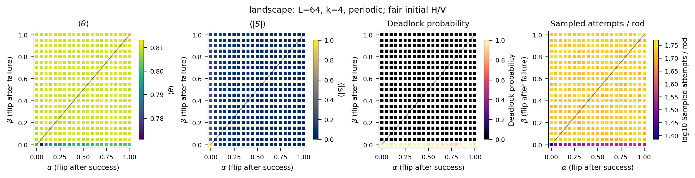
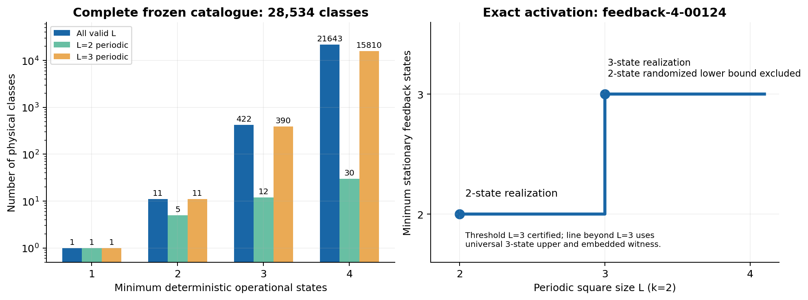
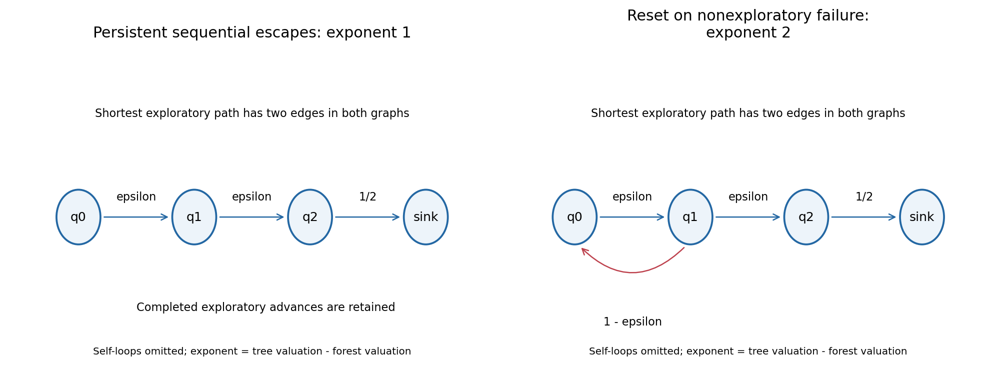

# OmniCivitas

**Outcome-only control of lattice adsorption: operational memory and certified temporal comparisons.**

A computational study of irreversible random sequential adsorption under a restricted information channel. A controller chooses horizontal or vertical rods and receives only the success or failure of its previous proposal. It cannot inspect occupancy, count legal placements, move deposited particles or restart the physical process. The comparison is with outcome-blind temporal controllers at the same *physical operational memory*.

This repository contains the simulator, behavioral catalogue, exact rational solvers, frozen empirical records, proof certificates, figures, manuscripts and interactive observation interface. Research is paused after its final authorized round. The manuscript is an AI-assisted research draft, **not a peer-reviewed publication**.



*Archived finite-size response landscape. Colour represents an empirical objective, not an exact capability theorem.*

## Main findings

For the periodic 3 × 3 dimer system, every proper deterministic one-bit feedback controller is weakly dominated by the convex hull of proper outcome-blind two-state temporal controllers. Consequently, for all nonnegative weights μ and ν,

```math
\max_{F\;\mathrm{proper,deterministic}} J(F)
\leq \sup_{T\;\mathrm{proper},\;|Q|\leq2} J(T),
\qquad J=\mathbb E[\theta]-\mu\mathbb E[|S|]-\nu\mathbb E[A/N].
```

The temporal family uses the complete edge-emitting hidden Markov representation: action and next state are sampled jointly. A linear objective on a convex combination is no better than on at least one component; the witness does not treat a mixture selector as free memory.



On both open and periodic 3 × 3 lattices, the two-state temporal density supremum is exactly **8/9**. Positive-parameter universally live families approach it. Finite attainment on the open lattice is not established, and convergence of density does not imply convergence of adsorption cost.

The open-boundary joint comparison remains unresolved. At (μ, ν) = (1.25, 0.4), the certified interval for the selected feedback advantage is

```text
−0.148856582394992 ≤ J(F10) − J* ≤ +0.007477505542617.
```

It crosses zero. It proves neither an advantage nor equality. Process-law separation can coexist with absence of a scoped averaged-objective advantage. The results do not establish raw-point inclusion, equality of nonconvex attainable sets, an arbitrary randomized-feedback theorem or a thermodynamic-limit claim.




*Finite-kernel excursion structure belongs to the rare-event methodological supplement; it is distinct from the adsorption capability theorem.*

## Evidence and implementation

| Retained evidence | Scope |
| --- | --- |
| 226,816 terminal simulations; 36 locked comparisons | Archived finite-size empirical record |
| 768 external rescue pairs; 192 direct probes | Diagnostic interventions, not controller capabilities |
| 64 deterministic encodings; 26 oriented / 13 symmetry-reduced classes | Outcome-only behavioral classification |
| 240,006 prefix nodes; 9,000 parameter leaf boxes | Certified support bounds and recomputed interval evidence |
| 6,800 rational Bellman equalities | Exact-law verification |
| 142 / 142 research tests in the final retained run | Model, enumeration, statistics and certificate checks |

These counts describe different evidence types; they are not independent replications of one result. Shared engines and reconstruction limits are documented in the [reproduction record](research/finite-memory-rsa/stage5/docs/REPRODUCTION.md). Negative results and unresolved intervals are retained.

| Read / inspect | Location |
| --- | --- |
| Unified manuscript | [FINAL_MANUSCRIPT.md](research/finite-memory-rsa/stage5/paper/FINAL_MANUSCRIPT.md) |
| Exact theorems and proofs | [FINAL_CAPABILITY_THEOREMS.md](research/finite-memory-rsa/stage5/docs/FINAL_CAPABILITY_THEOREMS.md) |
| Global certification | [GLOBAL_CERTIFICATION.md](research/finite-memory-rsa/stage5/docs/GLOBAL_CERTIFICATION.md) |
| Rational adsorption solver | [exact.mjs](research/finite-memory-rsa/src/exact.mjs) |
| Complete temporal kernels | [temporal.mjs](research/finite-memory-rsa/stage4/src/temporal.mjs) |
| Word-prefix bounds | [word-bound.mjs](research/finite-memory-rsa/stage5/src/word-bound.mjs) |
| Continuous parameter bounds | [parameter-bound.mjs](research/finite-memory-rsa/stage5/src/parameter-bound.mjs) |
| Certificate verifier | [verify-certificates.mjs](research/finite-memory-rsa/stage5/src/verify-certificates.mjs) |
| Final adversarial review | [FINAL_REVIEW.md](research/finite-memory-rsa/stage5/FINAL_REVIEW.md) |
| Literature and attribution | [FINAL_LITERATURE.md](research/finite-memory-rsa/stage5/docs/FINAL_LITERATURE.md) |


The scientific core uses Node.js without npm dependencies. A bounded reconstruction writes into a new directory and compares the retained 520-record quick reference, rather than rerunning the complete empirical programme:

```sh
cd research/finite-memory-rsa
node scripts/reproduce.mjs --profile quick --output ../rsa-check
```

The output directory must not already exist. Manuscript sources, scientific figures, data and original seals are published. **Compiled paper PDFs are excluded**, including from regenerated website download bundles. The original seal still lists the omitted PDF; [the publication policy](config/research-publication.json) declares its path, original hash and size. This is a documented subset of the sealed archive, not a new scientific seal. Figure PDFs remain available. No new experiments or PDFs were generated for this release.

With these distinctions, the next step in relating the operational trace hierarchy to the full joint capability region would be to

## 部署

回到仓库根目录。Web 界面使用 Astro、Next.js、Angular 和 NestJS；Docker 默认仅运行核心服务。常规开发、构建和主要功能不需要启动全部基础设施。

### 本地开发

安装 **Node.js 24.14.1**、**pnpm 10.34.6** 和 Git：

```sh
git clone https://github.com/cabal312512/OmniCivitas.git
cd OmniCivitas
pnpm install --frozen-lockfile
pnpm dev
```

打开 **http://127.0.0.1:8080**，研究界面位于 **/research/**。首次启动顺序准备 Angular、网关与科研下载包，再启动开发服务；大体积原始记录需要处理时间。Ctrl+C 停止。没有数据库 URL 时，开发入口明确使用有容量限制的内存存储，重启后不保留该数据。需要 PostgreSQL/Redis 持久化时使用 Docker 核心模式。

```sh
pnpm build
pnpm test
pnpm test:jest
```

五个构建目标默认顺序运行。端口可用 `OCV_WEB_PORT`、`OCV_PORTAL_PORT`、`OCV_NEXT_PORT`、`OCV_GATEWAY_PORT` 调整，四个值应互不冲突。标准命令不要求特定盘符、Windows 用户名、本机 PowerShell wrapper 或缓存变量。

### Docker 核心模式

Linux 使用 Docker Engine + Compose v2；Windows/macOS 使用 Docker Desktop 的 Linux 容器模式。在根目录运行：

```sh
docker compose up --build -d --wait
docker compose ps
```

默认启动 **edge、portal、next、gateway、PostgreSQL、Redis** 六个服务，入口仍是 **http://127.0.0.1:8080**。首次构建下载依赖并生成科研资源，请预留空间。仓库源文件接近 1 GB；安装包、镜像和构建缓存另占磁盘。

也可使用带预算的标准 Node 入口：

```sh
pnpm civilization:core
pnpm civilization:status
pnpm civilization:stop
```

控制器使用 3 GiB 构建器并顺序构建，完成后停止构建器。停止服务保留 named volumes。`docker compose down` 也保留数据；**`docker compose down -v` 会删除卷数据**。

### 按需服务

全部 24 个服务保留在 [compose.yaml](compose.yaml)。core 无需指定 profile，其余按工作需要选择。

| Profile | 额外服务 | 包含 core 的容器内存上限合计 |
| --- | --- | ---: |
| core | 默认六服务 | 1728 MiB |
| databases | MySQL、MongoDB、MinIO、archive API | 2944 MiB |
| legacy | Spring、FastAPI、Laravel、Fiber、ASP.NET SOAP、Sinatra、Hono、MySQL | 3616 MiB |
| messaging | RabbitMQ、Kafka、MongoDB、消息工作进程 | 3968 MiB |
| search | Elasticsearch | 3008 MiB |
| monitoring | OpenTelemetry、Prometheus、Grafana | 2240 MiB |
| maximum / everything | 全部可选服务 | 7840 MiB |

```sh
pnpm civilization:databases
pnpm civilization:legacy
pnpm civilization:messaging
pnpm civilization:monitoring
pnpm civilization:search
pnpm civilization:batch legacy,messaging,search
pnpm civilization:maximum
```

控制器切换组时停止不相关的可选容器。直接用 Compose 则会保留之前启动的服务：

```sh
docker compose --profile legacy up --build -d --wait
docker compose --profile legacy stop
```

小内存机器分批使用 profiles，避免全栈运行时同时编译。表中是容器上限，不是主机总内存预测；Docker、系统、缓存和编译还会占用内存。maximum 控制器默认拒绝总容器预算超过 **8192 MiB**；其他硬件可通过 `OCV_CONTAINER_BUDGET_MIB` 调整。Java、Kafka、Elasticsearch 使用小型开发 heap。重要服务设置内存、CPU、PID 与日志限制。

原开发机的 24 GB RAM / WSL 日常 9 GiB、可选最大 11 GiB 设置属于本地优化。公开命令不会修改别人电脑的 WSL 设置，也不要求相同硬件。

### 配置与持久化

仓库仅提供 [.env.example](.env.example)。需要修改时复制成 `.env`；真实 `.env` 不提交。

```sh
# Linux / macOS
cp .env.example .env
```

```powershell
# Windows PowerShell
Copy-Item .env.example .env
```

Compose 读取 `.env`；直接 `pnpm dev` 使用进程环境变量，需要在终端设置相应值。示例提供发布地址、端口、数据库/消息凭据、容器资源与 heap 参数。共享部署前更换示例凭据。`OCV_DATABASE_URL` / `OCV_RABBIT_URL` 可覆盖拼接的连接串，密码含保留字符须 URL 编码。

数据库初始化用户名、密码和库名只对 **新卷** 生效。已有卷改配置后连接失败，应维护现有账号或另建项目卷；不要为排错直接删除重要数据。

Docker 数据使用 **named volumes**，实际硬盘由 Docker 决定。默认 bind mounts 仅使用仓库内相对路径与只读配置。本机挂载放在忽略的 `compose.local.yaml`，显式执行：

```sh
docker compose -f compose.yaml -f compose.local.yaml up -d --wait
```

资源变量形如 `OCV_POSTGRES_MEM=512m`、`OCV_MESSAGE_BRIDGE_CPU=0.5`；完整参数见 `.env.example`。heap 应小于容器上限。发布地址默认 loopback。对外访问需显式调整 bind address，配置 HTTPS 反向代理、访问控制与防火墙；当前示例是开发部署配置。

### 常见问题

| 现象 | 处理 |
| --- | --- |
| Node / pnpm 不匹配、安装失败 | 使用上述版本，保留 lockfile，确认 npm registry 网络 |
| 首次进入前等待较久 | 初次科研下载包和前端构建需要时间；查看终端或容器日志 |
| 端口被占用 | 调整四个 `OCV_*_PORT`，不要重复使用同一端口 |
| Docker 无法连接 | 启动 Docker，确认 Linux 容器模式和 Compose v2，执行 `docker info` |
| optional 接口返回降级状态 | 启动对应 profile；降级不代表实际数据库/消息服务已运行 |
| 数据库改密码后无法连接 | 已有卷不会重新初始化；维护原账号或使用新项目卷 |
| 内存不足、编译被终止 | 回到 core，停止可选组，顺序构建；检查可用内存后再调整预算 |
| WebGL 场景为空 | 检查浏览器硬件加速和 WebGL；图形演示不改变原始科研结果 |
| 音乐不自动播放 | 浏览器可能要求首次点击后才允许音频；页面提供开关和音量 |
| 手工验封提示缺论文 PDF | 对照 publication policy 的明确排除项；其余文件仍必须匹配 |

### 测试与平台范围

单元测试不需要全栈。浏览器检查需要运行中的应用及相应浏览器：

```sh
pnpm exec cypress install
pnpm test:cypress
pnpm exec playwright install chromium
```

`OCV_BASE_URL` 可调整测试入口。日常使用专项检查。原生后端集成测试按需运行：

```sh
pnpm civilization:legacy
node scripts/test-languages.mjs java python php go dotnet ruby
```

helper 依次使用 768 MiB 测试容器，SDK 按需下载。公开移植性审计已执行 Windows 干净 clone、Linux 容器用户空间及新卷六服务 Compose 验证；独立 macOS / Linux Engine 宿主未验证。Actions 配置三系统检查，配置存在不等于 CI 已通过。[完整审计与限制](docs/PUBLIC-RELEASE.md)保留具体证据。

本机 `ocv.ps1` / `scripts/Enter-OcvEnvironment.ps1` 仅用于原开发环境的工具、缓存和 Docker 存储位置，其他电脑使用标准入口。不要提交 node_modules、工具、缓存、构建输出、真实配置、token、证书、数据库数据、Docker volumes 或 WSL 磁盘。小型第三方包也通过 package.json / pnpm-lock.yaml 安装。

### 许可与联系

原创代码采用 **MIT — Copyright (c) 2026 cabal312512**，见 [LICENSE](LICENSE)。第三方代码、字体、音乐及其他素材保留自身权利与许可，MIT 不重新授权它们。必要代码来源见 [THIRD_PARTY_NOTICES.txt](THIRD_PARTY_NOTICES.txt)、[EFFECT-SOURCES.md](docs/EFFECT-SOURCES.md) 和构建时生成的 `/licenses/bundled-notices.txt`。

素材声明：[MEDIA_NOTICE.md](MEDIA_NOTICE.md) / `/legal/`。研究音乐 **Holizna — Retro Wave Collection**，来源 [OpenGameArt](https://opengameart.org/content/retro-wave-collection)，CC0；其他既有作者与来源保留在声明中。联系：**user31436@proton.me**。

项目文件地图、停点与完整验收入口：[docs/HANDOFF.md](docs/HANDOFF.md)。
