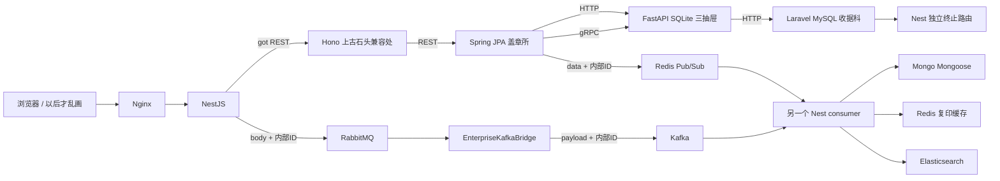

# 这口锅为什么要经过这么多窗口

默认只开 core。其他组按需开；切换组只停止本项目不属于目标组的容器，所有命名卷继续保留。第一次用到某组才下载它需要的工具链与镜像，实际存储由 F: 守卫确认。

```powershell
.\ocv.ps1 civilization:core
.\ocv.ps1 civilization:legacy
.\ocv.ps1 civilization:databases
.\ocv.ps1 civilization:messaging
.\ocv.ps1 civilization:search
.\ocv.ps1 civilization:monitoring
.\ocv.ps1 civilization:batch legacy,messaging,search
.\ocv.ps1 civilization:maximum
```

源码未修改、镜像已经构建时可加 `--reuse-images` 切组。修改源码后用常规命令重建；构建串行、builder 上限 3 GiB，构建期间只有核心组继续运行。WSL 每日 9 GiB 上限与 F: swap 不变；Windows 至少保留 2 GiB 实际可用内存。maximum 的 23 个容器限制合计 7328 MiB，并不代表实际会占满它；配置预算不替代实际内存采样。

| 组 | 容器限制合计 | 用途 |
| --- | --- | --- |
| core | 1216 MiB | 日常主页、基础保存、ID 映射、SSE/WS |
| legacy | 3104 MiB | 七语言小窗口及真实 MySQL；六跳 HTTP、gRPC、GraphQL、XML |
| databases | 2432 MiB | MySQL/Mongo/MinIO，Hono 的微小文件收发 |
| messaging | 3456 MiB | Rabbit/Kafka/两个工作器、Mongo；异步复制 |
| search | 2496 MiB | Elasticsearch；先有复制数据才有可搜索内容 |
| monitoring | 1728 MiB | OTel/Prometheus/Grafana，普通核心请求即可产生追踪 |
| maximum | 7328 MiB | 当前阶段的全部实际服务；构建后才启动 |

推荐分批：legacy 验证语言；messaging 验证转发；databases 验证文件；search 查索引；monitoring 看仪表。跨组完整副本与 Spring 日志用 batch legacy,messaging,search；MinIO/监控可单独验证，不要求长期常驻 maximum。



入口均通过 http://127.0.0.1:8080。Grafana 开启时位于 http://127.0.0.1:3001，匿名只读；不注册账户。数据库和消息端口不发布到宿主。

| HTTP 路径 | 实际职责 |
| --- | --- |
| POST /api/civilization-enterprise.do | label 玩具收据 → Prisma 映射 / TypeORM 分类 / Redis 缓存 / Rabbit 确认；可选设施缺失时明确报告 pendingReplication |
| POST /api/stamp-everywhere.php | 六跳 HTTP；不同 ID、布尔值、日期字段，最终适配为同一时刻 |
| POST /api/spring-direct.cgi | Nest → Spring REST，不经过 Hono |
| POST /api/grpc.asmx | Nest REST → Spring → Python gRPC |
| POST /api/spread-object.do/:UUID | 把已存在的同一个 PostgreSQL UUID 发到 MySQL、SQLite；不从用户接收伪造显示名 |
| GET /api/split-object.do/:UUID | 拼回 UUID / MySQL 名称 / Mongo 附加字段 / Redis 状态 / SQLite 无关时间 |
| GET /api/department.do/{hono,graphql,ruby,go,analysis,minio,mysql} | 七个无意义职责的真实服务；mysql 支持 q 的绑定 LIKE 查询 |
| GET /api/PotatoTaxService.asmx | ASP.NET 的 SOAP 形状 XML，空气税为 0 |
| GET /api/fragment.cgi | Hono 的 HTML 碎片 |
| GET /api/receipt-events.cgi | 三句实际 SSE，然后结束 |
| WS /api/enterprise-ws.cgi | 一句公告；最多 16 连接、8 KiB 帧、120 秒寿命 |
| GET /api/metrics.cgi | 盖章次数与石头重量，Prometheus 实际采集 |
| GET /api/reconcile.do | 超长名字的周期任务也可手动触发：最多读 16 条、比较几个字段，修复玩具副本 |

收据 JSON 只接收 label 和有限 ornament。ornament 无语义验证，但身份、密钥形状字段仍拒绝。各服务重复 DTO，仅 Hono 使用 shared-types。成功时可叫 errorMessage，失败时可叫 successReason，判断行为始终看 canContinue。

phase2-*.json 是运行验收报告，位于 F:\OCVdeps\runtime\reports；失败报告不能算完成。编号原文与每项证据继续放在 requirements.json。这里的 API 供后续前端接入，此阶段不声称已做好前端。
