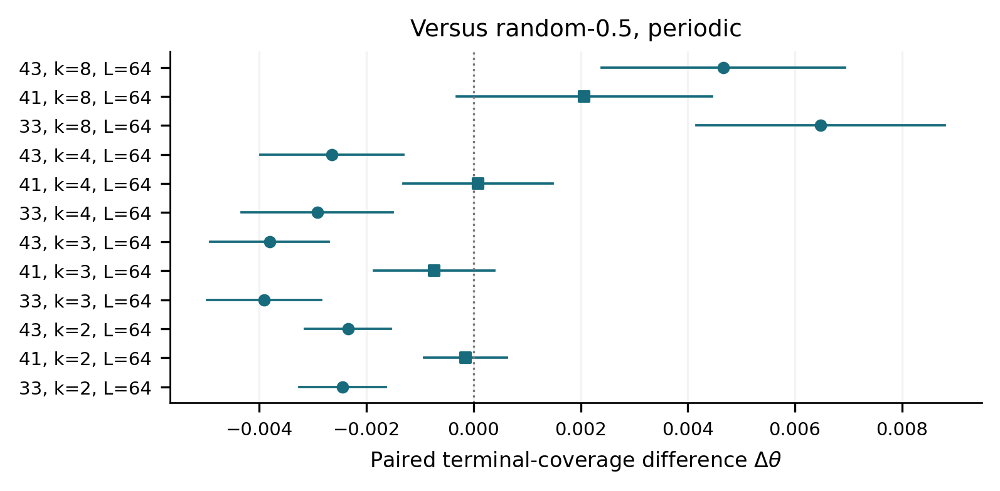
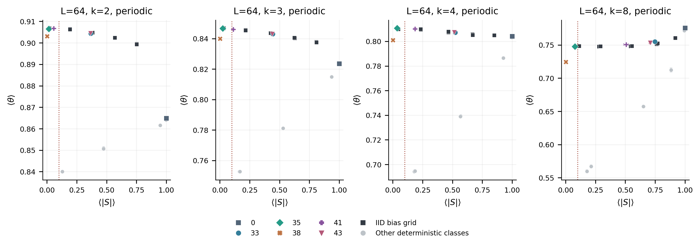
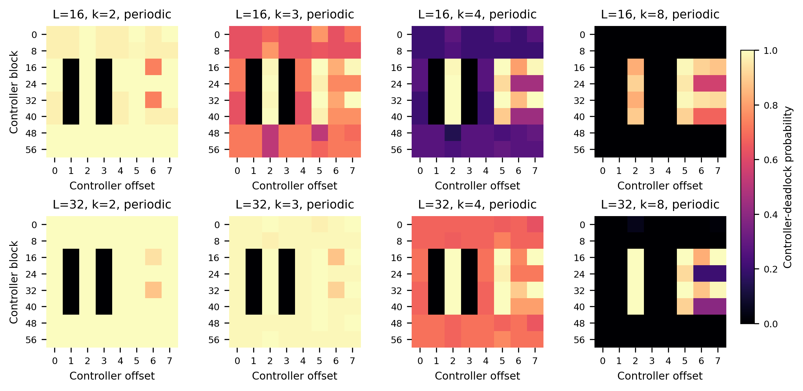
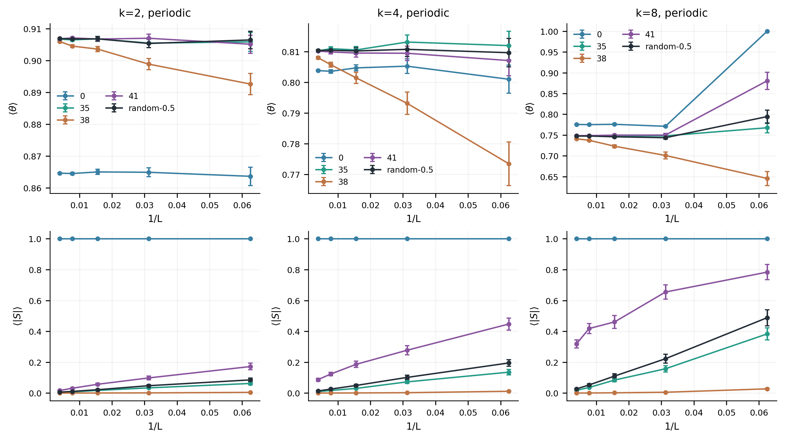

# One bit, two stopping mechanisms: finite-state temporal control of lattice adsorption

Independent computational research report | 4 October 2026 | Unsubmitted draft

## Abstract

Can one bit of internal state control irreversible random packing without observing space? We study straight k-mers on a square lattice, with uniformly random candidate anchors and a controller that sees only its own state and binary success/failure. All 64 deterministic two-state controllers are enumerated. Rooted behavioural minimization leaves 26 orientation-labelled classes and 13 classes under H/V exchange. We derive a failure-cycle certificate that distinguishes geometric jamming from controller-induced deadlock, and use it to construct a cutoff-free event sampler and rational small-system solver. Main data comprise 226,816 terminal simulations, supplemented by 768 geometric-rescue interventions and 192 direct trial trajectories. Confirmation uses 512 new seeds per policy/stratum and a fixed 36-test family. No tested feedback class demonstrates a multiplicity-adjusted, low-anisotropy coverage advantage over both fair i.i.d. orientation and open-loop alternation. A near-perfectly balanced success-alternating policy instead deadlocks in 91.8-94.9% of 64 x 64 runs. The conclusions concern this finite model and studied sizes; they are not an impossibility theorem for memory, a thermodynamic phase claim, or a claim of priority over existing outcome-dependent RSA protocols.

## 1. Introduction

Random sequential adsorption (RSA) deposits particles one at a time, rejecting overlaps and never rearranging accepted particles. Its simple rules generate nontrivial saturation, spatial correlations and finite-size effects [1, 2]. We ask a restricted control question: can a temporally informed controller influence final packing when candidate positions remain independent and uniformly random, and no position, coverage, neighbourhood or legal-placement count is observable to the controller?

The restriction matters. Aligned orientation can improve packing for some rod lengths without providing any evidence that memory helps. Likewise, a mixture of pure-H and pure-V realizations has zero ensemble mean signed orientation order while every realization is fully anisotropic. A finite failure cutoff can also confuse slow deposition, policy deadlock and geometric jamming. The project therefore treats terminal coverage, realization-wise absolute orientation order and terminal reason as separate outcomes.

Our contributions are a complete small-controller classification, explicit terminal-state mathematics, independently validated sampling, and a held-out comparison against temporal and bias nulls. The empirical result is qualified and largely negative for isotropic feedback improvement. The distinction between balanced deposits and robust termination remains a useful positive finding.

## 2. Related work and the novelty boundary

Evans [1] reviews random and cooperative sequential adsorption. Ziff [2] studies arrival-history imprints in jammed one-dimensional dimer deposits; this structural memory is distinct from internal controller memory. Bonnier et al. [3] study isotropic square-lattice k-mers and finite-size effects, while Lebovka et al. [4] compare partially oriented RSA and relaxation RSA. Gan and Wang [5] give the high-precision isotropic square-lattice dimer estimate 0.906823(2), useful for a large-system baseline check. Availability is already an established observable; Purvis et al. [6] analyze its relationship to coverage and adsorption kinetics.

The relaxation RSA (RRSA) protocol in [4] retains a rejected particle's orientation while drawing new positions, then redraws orientation after success. Outcome-dependent temporal orientation choice therefore predates this study and can be represented as a stochastic two-state controller. Our descriptive RRSA-like reference implements that retention/redraw rule, starting with a fair random direction and terminating when its held direction has no legal placement. Under our allowed set {H, V}, remaining placements in the opposite direction are labeled controller deadlock. The source describes stopping upon exhaustion in one direction; we have not established that all details of its stopping convention match ours. Its tabulated endpoint coverages are consequently contextual comparisons rather than same-protocol ground truth, including for this descriptive reference.

A targeted search and 12 verified bibliography entries are archived, including 38 recorded queries and explicit full-text/abstract access levels. This is not a systematic review. We have not located the exact combination of exhaustive rooted two-state classification, controller-aware absorption and the comparison used here, but no first-ever claim follows. The 2012 publisher note to [4] was identified but its text was not retrieved; its contents are not inferred. The notes also flag an apparent printed aligned-dimer discrepancy: the mathematical value is 1-exp(-2)=0.864664716763, rather than 0.864665717.

## 3. Model and observables

The substrate is an LxL square lattice. A deposited rod occupies k adjacent empty sites in H or V orientation, with 1<=k<=L. Periodic anchors number M=L squared per orientation. Open-boundary anchors are chosen uniformly among M=L(L-k+1) wholly contained candidates. Periodic anchor multiplicity is retained even when k=L. Sampling all open-lattice sites and treating boundary-crossing candidates as failures would be a different feedback process.

At trial t, the controller chooses O_t=g(q_t) before the random anchor is examined. The trial returns Y_t in {failure, success}, then q_(t+1)=f(q_t, Y_t). The controller observes no lattice, position, coverage, time or available-placement count. The deterministic enumeration starts at q_0=0; the separate RRSA-like reference randomizes its initial direction. H=0, V=1 and failure=0, success=1. ID bits 4+q encode g(q); bits 2 q+Y encode f(q, Y). Four output functions times 16 transition tables give 64 labelled controllers.

If N_H and N_V particles are accepted, terminal coverage is theta=k(N_H+N_V)/L squared, signed order is S=(N_H-N_V)/(N_H+N_V), and the principal isotropy outcome is the ensemble mean of run-wise |S|. An operational low-anisotropy threshold of 0.1 is specified for confirmation. This threshold is not a universal definition of isotropy. Attempts and failures are counted only before entry into a diagnosed terminal state; the indefinitely many later failures of a deadlocked process are excluded.

Let A_H and A_V denote legal-anchor counts, used only by the simulator. A geometric jam has A_H=A_V=0. A controller-induced deadlock retains at least one legal orientation but its actual state cannot produce another successful placement. We report **terminal coverage** for all policies and reserve **jamming coverage** for geometric jams. Fixed-H is geometrically jammed in a one-orientation model but may be deadlocked under the two-orientation set used here.

## 4. Controller classification and terminal mathematics

### 4.1 Rooted behavioural quotient

Equivalence is equality of output sequences for every finite binary feedback word from the declared initial state. We first remove unreachable states, then minimize the output-labelled automaton, and canonically number states from its root. State relabeling must carry the root; exchanging names while silently resetting the initial state is invalid.

Constant outputs and unreachable second states collapse to always-H or always-V. For distinct outputs, the second state is reachable if at least one outcome edge from state 0 enters state 1; 12 transition tables meet this condition for each initial output. Hence there are 2+12+12=26 rooted orientation-labelled behaviours. H/V exchange pairs them into 13 classes. This is an input/output quotient, not a claim that all 13 classes have different RSA coverage distributions on every lattice.

### 4.2 Failure-path certificate and fairness

Failures leave the lattice unchanged. Follow the deterministic failure edges from the current state until a state repeats. If every orientation on that finite prefix and cycle has zero legal anchors, no future success is possible. Conversely, a positive legal count on a reachable transient state offers a positive success probability; such a state must be sampled before a zero-success cycle is declared absorbing.

For any controller whose recurrent failure cycles visit both orientations, non-geometrically-jammed deposition cannot stay blocked forever: some visited state has success hazard at least 1/M, repeated opportunities succeed almost surely, and each success adds k occupied sites. This is a sufficient universal guarantee. Among the 64 raw two-state codes, exactly 8 satisfy this structural failure-fair condition:17, 19, 25, 27, 33, 35, 41, 43. Their four H-first representatives are 33, 35, 41, 43. The next-success expectation is bounded by 2 M in this family. A graph that fails the certificate is not automatically deadlocked from an empty lattice at every L and k. Exact examples below show why that stronger statement would be false.

### 4.3 Exact event law

For a fixed lattice let a_i=A_(g(q_i))/M along a failure cycle. A complete failed cycle has probability B=product_i(1-a_i). For B<1, we sample the number of complete failed cycles geometrically; conditional on cycle success, the first successful state has mass product_(j<i)(1-a_j)*a_i/(1-B). For B=1, the cycle is absorbing: it is geometric jamming if both global legal counts vanish, otherwise controller deadlock. The accepted anchor is uniform among its legal anchors. Transient prefixes retain their original trial probabilities and are sampled before the cycle is examined. This is a change in simulation clock, not a spatially informed action policy. The original waiting-time law is retained, subject to ordinary finite-precision pseudorandom sampling limitations.

For a memoryless H probability p, next-success weights are p*A_H and(1-p)*A_V. The hazard is their sum divided by M. Individual failed directions are not sampled by this baseline's event engine and are left empty in the corresponding CSV fields. Direct trajectory experiments record every original trial. Legal sets are maintained incrementally by invalidating only candidates crossing newly occupied cells.

### 4.4 Rational absorption and a local mechanism

Successful events strictly increase occupancy, making recursion over occupancy masks acyclic after failure cycles are eliminated. A BigInt rational solver computes complete terminal distributions for 384 controller/system combinations across 2 x 2 and 3 x 3 systems, two boundaries and eligible k values, plus baselines. An independent full-trial Markov graph, strongly connected components and floating Gaussian elimination cross-check selected systems rather than reusing the production recursion.

After a single isolated H rod on a periodic lattice with L>=2 k, exactly 2 k-1 H anchors and k squared V anchors are blocked. For policy 41, which stays after success and flips after failure, the next accepted rod is H with probability a/(a+b-ab), where a=A_H/M and b=A_V/M. Even a=b gives 1/(2-a)>1/2: substantial early persistence exists without geometric anisotropy. Holding a fixed and replacing b by a defines an equal-availability counterfactual. The actual probability minus that counterfactual is (a-b)(1-a)/[(2-a)(a+b-ab)], order M to the power -2 at fixed k. This local calculation neither proves nor explains away a macroscopic symmetry-breaking limit.

| Policy | exact theta | decimal theta | P(deadlock) |
| --- | --- | --- | --- |
| fair | 48/55 | 0.872727 | 0/1 |
| 35 alternating | 21304/24219 | 0.879640 | 0/1 |
| 0 fixed-H | 2/3 | 0.666667 | 7/9 |
| 46 size-specific | 8/9 | 0.888889 | 0/1 |

Table 1. Exact periodic 3 x 3 dimer examples. Open-loop alternation is not feedback benefit. ID 46's finite-system jam does not establish universal fairness.

## 5. Experimental and statistical methods

| Experiment | L | k | runs/stratum | total runs |
| --- | --- | --- | --- | --- |
| atlas | 16/32 | 2/3/4/8 | 64 | 33280 |
| confirmation | 64 | 2/3/4/8 | 512 | 45056 |
| finite_size | 16/32/64/128/256 | 2/4/8 | 128 | 9600 |
| small_validation | 2/3 | 2 | 4096 | 131072 |
| open_boundary | 32/64/128 | 2/4/8 | 128 | 5760 |
| rrsa | 64 | 2/3/4/8 | 512 | 2048 |

Table 2. Main terminal runs. Exploratory atlas seeds 100001 onward are disjoint from locked confirmation seeds 200001 onward. Size study seeds 300001, rational-validation seeds 400001, open-boundary seeds 600001 and later RRSA seeds 700001 define separately labelled experiments. A common seed across policies enables a paired comparison, but does not mean that policies see an identical attempt tape.

The complete 64-code pilot informed which research question to confirm; all 13 H-first behavioural classes and a fixed memoryless p grid 0.1 through 0.9 were then retained at L=64, k=2, 3, 4, 8 with 512 new seeds per stratum. The confirmatory family was sealed before those data began: three universally failure-fair feedback representatives 33/41/43 versus both fair i.i.d. orientation and open-loop 35, giving 24 paired coverage tests, plus 12 one-sided mean-|S| tests against 0.1. No holdout winner or best bias was chosen for a naive single test.

The independent complete run, not an attempt or particle, is the replicate. We use sample standard deviations and Student-t pointwise 95% intervals for means, Wilson intervals for terminal reason, paired Student-t intervals for coverage differences, Holm correction across all 36 prespecified tests, and Bonferroni simultaneous intervals for that family. Exact and stochastic checks distinguish pointwise calibration from family coverage. Plugin conditional information estimates from 192 direct trajectories are exploratory and nonstationary, not causal information-performance measurements.

The original lock is preserved. Two post-lock analysis implementation fixes were logged: replacing a large argument-list spread to read 131,072 rows safely, and calculating a beta-tail p value directly to prevent floating-point subtraction from rounding a small p value to zero. Neither fix changed policies, seeds, family, formulas or selection. Original failed logs remain separate from final passed checks.

## 6. Results

### 6.1 Low-anisotropy feedback advantage was not confirmed

| k | fair theta | 35 theta | 41 theta | 41 mean abs(S) | 38 theta | 38 deadlock |
| --- | --- | --- | --- | --- | --- | --- |
| 2 | 0.906837 | 0.906557 | 0.906686 | 0.056867 | 0.903084 | 0.9180 |
| 3 | 0.846850 | 0.846683 | 0.846113 | 0.111328 | 0.840005 | 0.9238 |
| 4 | 0.809994 | 0.810711 | 0.810076 | 0.186580 | 0.801004 | 0.9375 |
| 8 | 0.748451 | 0.747852 | 0.750519 | 0.506429 | 0.724598 | 0.9492 |

Table 3. L=64, 512 runs per row/stratum; coverage means are fractions, not percentages. Complete per-run values, pointwise intervals and all descriptive classes are in the machine-readable summaries.

Policy 41 passes the locked low-anisotropy criterion for dimers, with mean|S|=0.05687. Its dimer coverage difference from fair i.i.d. orientation is-0.0001516, simultaneous 95% interval[-0.0009273, 0.0006241], Holm p=1. Against open-loop 35 it is+0.0001287, interval[-0.0006763, 0.0009338], Holm p=1. This is lack of confirmed improvement, not proof of exact equality. Those intervals state the finite-sample resolution.

At k=8, 41 improves over open-loop 35 by 0.0026665, simultaneous interval[0.0002751, 0.0050578], Holm p=0.00703, but mean|S|=0.50643 fails the low-anisotropy condition. Its comparison with fair orientation gives Holm p=0.0980. Resetting representatives 33/43 are significantly worse than the two nulls for k=2, 3, 4, and denser but strongly anisotropic for k=8. Marginal coverage alone would therefore tell a misleading story.

Figure 1. Paired coverage differences with family simultaneous intervals. Circles indicate Holm rejection; squares indicate non-rejection. Isotropy must be checked separately.

Figure 2. All 13 held-out behavioural representatives and fixed memoryless bias controls. This tradeoff plot is descriptive; neither its best point nor a fitted continuum optimum is a new confirmatory test.

### 6.2 Strict balance can coexist with frequent policy deadlock

ID 38 flips only after success and holds after failure. Accepted rods therefore alternate exactly, so |N_H-N_V|<=1, and |S| is zero or 1/(N_H+N_V). Nevertheless, the held direction can run out of legal placements while the other remains possible. At L=64, deadlock rates for k=2, 3, 4, 8 are 91.80%, 92.38%, 93.75%, 94.92%, despite mean|S| between 0.000266 and 0.001419. An arbitrary long failure timeout would have mislabeled these as geometric jams.

Our RRSA-like reference with fair redraw after success yields theta 0.901698, 0.837280, 0.798304, 0.719833 for the same lengths, with about 95% deadlocks under our two-orientation terminal labels. Its per-run |S| is small, but exact accepted alternation is absent. This reference was added after initial confirmation and is explicitly descriptive, not part of the 36-test family.

Figure 3. Exploratory deadlock probability over the full raw controller encoding. Repeated codes can be behaviourally equivalent; the atlas is not 64 independent hypotheses.

### 6.3 A geometric rescue exposes unused capacity

We froze 256 independent ID 38 terminal lattices for each k=2, 4, 8, then let an external observer continue fair i.i.d. deposition until geometric jamming. No existing particle moved or disappeared. This intervention uses information unavailable to the original controller and is **not** a valid one-bit policy. Its paired gain measures unrealized capacity rather than admissible feedback performance.

| k | before theta | after theta | paired gain | 95% gain interval |
| --- | --- | --- | --- | --- |
| 2 | 0.903107 | 0.906891 | 0.003784 | [0.003361,0.004208] |
| 4 | 0.800724 | 0.810467 | 0.009743 | [0.008882,0.010604] |
| 8 | 0.724831 | 0.748634 | 0.023804 | [0.021412,0.026195] |

Table 4. Diagnostic continuation, including zero gains; intervals are descriptive pointwise 95%, not newly corrected primary claims. Every original occupied cell was preserved and final legal counts were zero.

### 6.4 Finite sizes, boundaries and external baselines

The independent size study spans L=16, 32, 64, 128, 256 for five policies at k=2, 4, 8. For L=256 dimers, fair orientation gives 0.9069307 with 95% interval[0.9067839, 0.9070774], covering the literature estimate 0.906823. Aligned dimers give 0.8646326 with interval[0.8644663, 0.8647989], covering 1-exp(-2). These are statistical compatibility checks, not six-digit reproduction claims.

For policy 41, k=8, mean|S| falls from 0.7837 at L=16 to 0.3183 at L=256; for k=4 it reaches 0.0869 at L=256. The L=16, k=8 coverage is strongly affected by small periodic geometry and commensurability. A small-lattice biased plateau must not be called a phase. We show observed finite-size curves without forcing a thermodynamic power law or extrapolated optimum. Open-boundary controls are archived independently; the candidate-anchor convention is stated because boundary failures would otherwise alter feedback.

Figure 4. Independently seeded size measurements and pointwise intervals. Size dependence remains material, particularly for long rods; these curves do not establish a thermodynamic transition.

### 6.5 Feedback usage is distinct from performance

Direct attempt trajectories verify the exact outcome-conditioned switch rules: open-loop 35 switches after both outcomes;38 switches after success only;41 after failure only; fair orientation switches with probability near 1/2 after either outcome. Conditional I(Y_previous;switch|O_previous) separates these mechanisms more clearly than pooled I(Y_previous;O_current), which can cancel by orientation symmetry or reflect nonstationarity.

At L=32, k=4, the plugin conditional information means are about 0 for 35, 0.217 bits for 38, 0.190 bits for 41 and roughly 0.0001 bits for fair orientation. Small positive baseline estimates are consistent with finite-sample bias. We do not interpret these diagnostics as directed information, entropy rate, a causal information budget, or a conversion rate from bits to coverage. Strong feedback use and good packing are separate properties.

## 7. Validation and reproducibility

Incremental legal sets are checked against independent full-footprint scans after deposition, both boundaries and k=L. Monomers fill every site for all 64 codes. Event and direct engines agree on small-system laws. Rational probabilities are independently checked by full-trial transition graphs. An additional 131,072 direct/event validation runs cover 144 joint(N_H, N_V, terminal reason) probability checks; all lie within the 99% Bonferroni Clopper-Pearson family intervals. Main small-system Monte Carlo data independently compare 32 groups of 4096 runs with the rational results; the read-only audit found no substantive 95% interval mismatch, recording four Wilson endpoint roundoff cases separately.

Every terminal experiment saves parameters, explicit seeds, source hashes, runtime version, raw CSV and a completed manifest. Raw data and analysis are separate; figures are regenerated from processed data. No inference treats attempt count as sample size. The terminal engine has no failure-run stopping threshold. Completed data never inherit a result from a safety-bound exception.

`node scripts/reproduce.mjs --profile quick` works with standard Node and no research packages, website service or Docker. `--profile full` reproduces the main study into a separate output directory and regenerates its independent lock. Scientific columns are compared separately from nondeterministic wall-time fields. NumPy and Matplotlib are needed only for figures; ReportLab and pypdf only for this PDF. The local F-drive environment is a development choice and is not a public prerequisite.

This project was developed with AI coding and research assistance. The numerical results were produced by the archived executable code and actual runs, not generated prose. The draft has not undergone external peer review; an independent human scientific review is still required before any submission.

## 8. Limitations and open questions

The experiment does not prove that all possible finite-memory or stochastic policies fail to improve isotropic adsorption. Its deterministic family is fully enumerated, but primary confirmation focuses on the three structurally failure-fair H-first feedback classes. The bias controls are a finite fixed grid, not all real p. Behavioural equivalence under all binary words may distinguish controllers that happen to coincide on some physically accessible RSA states.

Our fairness certificate is sufficient for any non-jammed lattice and identifies eight raw codes, but it is not asserted necessary for safety from an empty substrate at every fixed size. Exact tiny lattices demonstrate size-specific coincidences. Finite-precision floating geometric sampling and deterministic pseudorandom streams are recorded approximations to an ideal probabilistic model; the exact rational and independent direct oracles constrain implementation error.

No universal scaling exponent, phase transition, infinite-volume feedback optimum, or computationally exhaustive four-state landscape is claimed. Noise, delays, broader particle shapes and the 1,048,576 labelled two-bit controllers are deferred because the present evidence supports a clear one-bit question before those costs. The most useful next questions concern the asymptotic fate of 41's anisotropy, when finite-size near-balanced deadlock has vanishing coverage cost, and whether stochastic failure-fair controllers can improve the constrained frontier against temporal nulls.

## 9. Conclusion

A single state bit is sufficient to alter temporal adsorption and termination, but those changes need not constitute beneficial information use. Complete classification exposes both a small universally failure-fair family and near-balanced strategies that leave legal placements unused. Exact absorption, cutoff-free event sampling and held-out null comparisons support the distinction. Within the studied confirmation design, no feedback class achieves a confirmed low-anisotropy coverage gain over the fair i.i.d. and open-loop temporal references. That qualified negative result, together with explicit controller-induced deadlock, is the scientific outcome.

## References

1. J. W. Evans. Random and cooperative sequential adsorption. Reviews of Modern Physics 65, 1281-1329(1993). https://doi.org/10.1103/RevModPhys.65.1281
2. R. M. Ziff. Traces of the arrival history in the jammed state of random sequential adsorption. Journal of Physics A: Mathematical and General 27, L657-L662 (1994). https://doi.org/10.1088/0305-4470/27/18/003
3. B. Bonnier, M. Hontebeyrie, Y. Leroyer, C. Meyers, E. Pommiers. Adsorption of line segments on a square lattice. Physical Review E 49, 305-312(1994). https://doi.org/10.1103/PhysRevE.49.305
4. N. I. Lebovka, N. N. Karmazina, Y. Y. Tarasevich, V. V. Laptev. Random sequential adsorption of partially oriented linear k-mers on a square lattice. Physical Review E 84, 061603(2011). https://doi.org/10.1103/PhysRevE.84.061603
5. C. K. Gan, J.-S. Wang. Extended series expansions for random sequential adsorption. Journal of Chemical Physics 108, 3010-3012(1998). https://doi.org/10.1063/1.475687
6. B. E. Purvis, L. Reeve, J. A. D. Wattis, Y. Mao. Scaling behavior near jamming in random sequential adsorption. Physical Review E 91, 022118 (2015). https://doi.org/10.1103/PhysRevE.91.022118

The full 12-entry bibliography, including the unretrieved publisher note and explicit access status, is in literature/references.bib and literature/notes.md.
