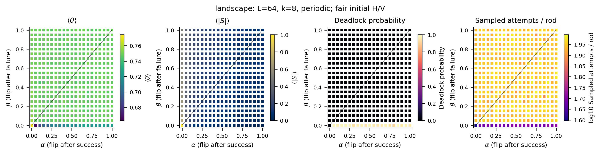
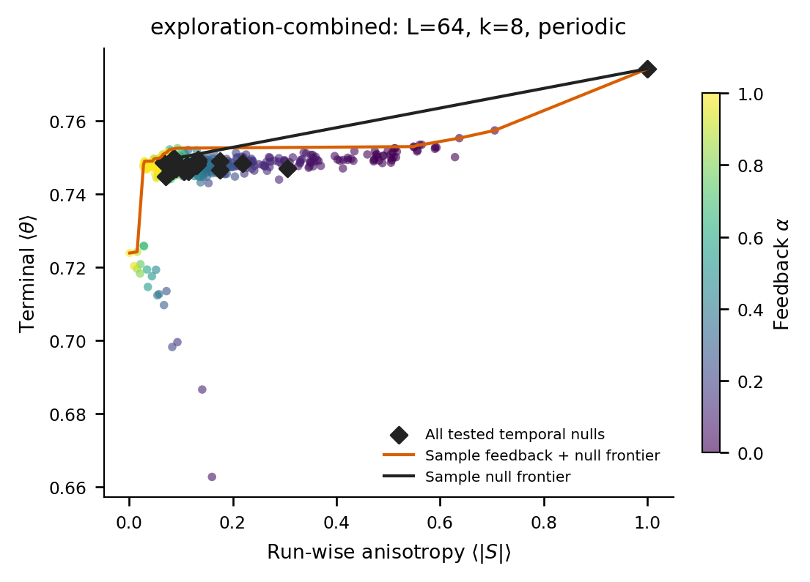
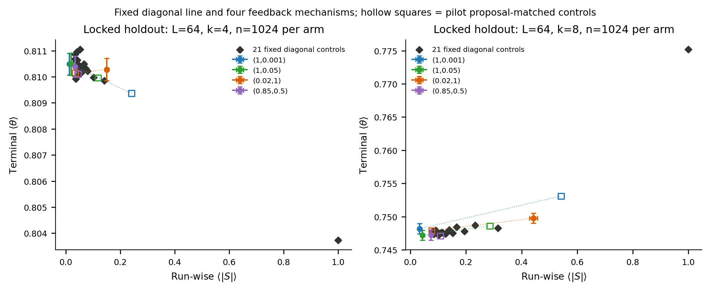
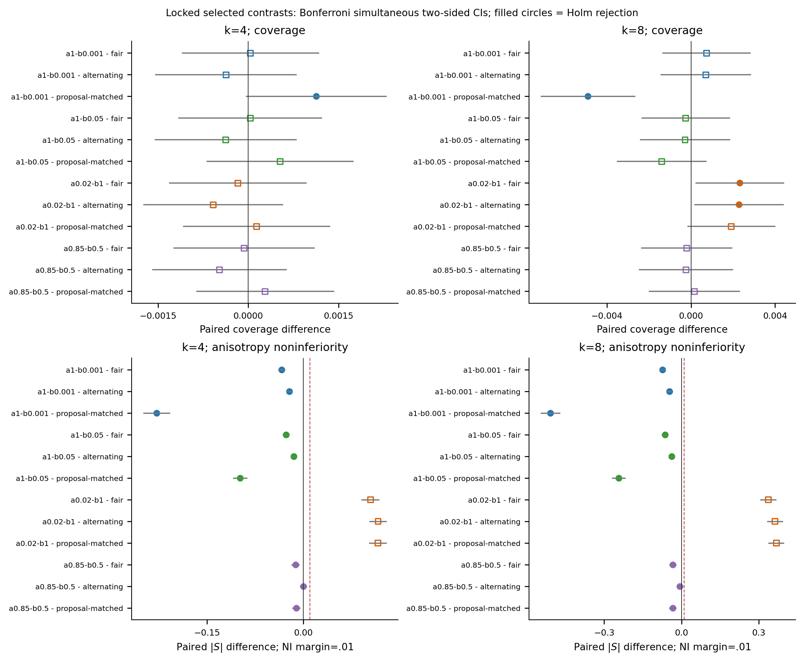
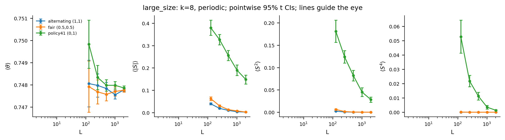
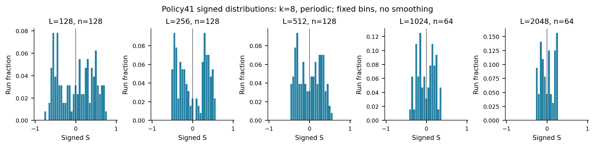

# Stochastic one-bit feedback in irreversible lattice packing

Independent computational research draft | Stage II | 4 October 2026 | AI-assisted, not externally peer reviewed

## Abstract

Can a controller with one state bit improve irreversible packing by observing only success or failure, rather than by imposing ordinary temporal correlations? We study square-lattice random sequential adsorption of horizontal and vertical k-mers. The controller flips orientation with probability alpha after success and beta after failure, starts with a fair orientation, and receives no spatial information. The diagonal alpha=beta supplies an outcome-independent temporal null. We separate parameter exploration, finite-size description, and an independently seeded, locked 400-test confirmation family. Across 143,232 main terminal runs, including 62,464 confirmation runs, no selected controller confirms both a coverage gain and anisotropy non-inferiority against fair orientation, strict alternation, or the complete tested null frontier. Near-success-alternation feedback nevertheless extends the observed tradeoff toward lower absolute order. There is a narrower positive result: at L=64, k=4, (alpha,beta)=(1,0.001) improves coverage by 0.001126 over its pilot-fitted proposal-persistence null, with Holm-adjusted p=0.04363 and much lower absolute order. This comparison does not isolate feedback from every temporal statistic. A new policy-41 size study reaches L=2048: absolute order decreases, but its infinite-size limit and coverage advantage remain unresolved. We prove a geometry-conditioned necessary-and-sufficient liveness criterion using the substochastic failure kernel. Every positive beta prevents policy deadlock on a finite lattice, while a blocked-direction wait can diverge as 1/beta. Rare excursions also produce a discontinuous mean from a legal start without divergence. Fifty-two rational absorbing laws, 212,992 small-system Monte Carlo runs, and 700,000 fixed-geometry waiting draws support the implementation and distinguish liveness, density, anisotropy, and kinetic cost.

## 1. Questions and scope

Random sequential adsorption (RSA) deposits particles irreversibly when they do not overlap earlier particles. Its jammed states are nonequilibrium objects, and altered arrival histories can change the packing process [1]. Here the controlled quantity is orientation; the proposal position remains uniformly random. The scientific question is whether a small amount of outcome history adds useful control beyond the temporal dependence of the orientation sequence.

The archived Stage I study classified deterministic one-bit controllers and exposed two different mechanisms. Preserving direction after success and changing it after failure, called policy 41, can increase density together with substantial run-wise orientation imbalance. Changing direction after success only, policy 38, nearly balances accepted rods but can become trapped while legal placements remain. Strict attempt alternation, policy 35, uses no outcome feedback. Those results, code, datasets, and conclusions are retained unchanged; the present study supplies new stochastic experiments rather than retesting Stage I until a positive result appears.

We address three questions. Q1 asks whether outcome dependence improves the coverage-anisotropy tradeoff against temporal controls. Q2 asks what the observed policy-41 effect retains at larger finite sizes. Q3 asks which controller structures avoid an absorbing failure state of their own making. Q3 receives a theorem; Q1 receives qualified finite-comparison evidence; Q2 receives substantially larger measurements but no resolved thermodynamic limit. These are different levels of conclusion.

## 2. Model, observables, and temporal controls

An initially empty L by L lattice receives rods covering k consecutive cells in orientation H or V. A proposal is accepted if every cell in its footprint is empty. Accepted rods never move or disappear. Periodic experiments sample all M=L^2 anchored candidates for the current direction, retaining the correct multiplicity when distinct anchors share a footprint. Open-boundary experiments sample only entirely contained rods, so M=L(L-k+1) per direction. Out-of-domain anchors are excluded rather than counted as failures. This convention matters because changing failure frequencies changes the feedback process.

The state bit is the direction of the next proposal. Following outcome Y, an independent draw flips this bit with probability alpha if Y is success, and beta if Y is failure. Initial H/V is a fair draw in every arm. The controller knows its own state and outcome but cannot inspect occupancy, candidate coordinates, density, the legal-placement counts, or the simulation clock. Exact legal counts used internally by the simulator condition its event calculation; they are not controller observations.

| (alpha,beta) | Proposal rule | Correspondence |
| --- | --- | --- |
| (0,0) | Keep the initial direction | Fair mixture of aligned H and V |
| (0,1) | Keep success, flip failure | Policy 41, mixed over its two initial directions |
| (1,0) | Flip success, keep failure | Policy 38, with possible deadlock |
| (1,1) | Flip every proposal | Policy 35; outcome-independent alternation |
| (1/2,1/2) | Draw the next direction fairly | Fair i.i.d. orientation |
| (p,p) | Flip independently of outcome | Temporal-null line |

Table 1. Initial fairness is an ensemble property, not a guarantee that each terminal packing is balanced. The deterministic ID correspondences include both initial orientations.

For N=N_H+N_V accepted rods, terminal coverage is theta=kN/L^2 and signed order is S=(N_H-N_V)/N. We record E[theta], E[|S|], E[S], E[S^2], E[S^4], the full empirical signed distribution, and terminal reason. A geometric jam has no legal H or V placement. A controller deadlock is absorption in a closed failure class even though at least one legal placement remains. Diagnosing a closed deadlock stops the recorded process on entry; its subsequent infinite failure tail is not a finite kinetic observation. Deadlocked packings remain in terminal means.

On alpha=beta=p, the orientation update ignores outcomes. Before terminal censoring, the fair two-state chain has adjacent sign-product expectation 1-2p and geometric direction-run lengths for p>0. Deposition filters that proposal sequence. Adjacent accepted-rod statistics therefore need not match adjacent proposal statistics, even for this simple null.

We save actual attempts and failures per accepted rod, accepted-run histograms, and separate proposal and accepted switching fractions. The reported lag-1 statistic is the uncentered sign-product mean, 1-2 times the relevant adjacent switching fraction, rather than a centered Pearson correlation. The final success update has no following proposal and is excluded from trial adjacency. Event simulation does not retain the full ordering of aggregated failures, so its trial-run histogram and maximum stay missing; they are not fabricated from the observed mean.

## 3. Liveness and waiting-time theory

### 3.1 The failure kernel must include geometry

Consider a finite-state controller with state q, action probabilities pi(o|q), and a failure-transition law T_F(q'|q,o). For a frozen lattice X, write a_o for the probability that a uniform proposal in direction o succeeds. Assume fresh proposal and controller randomization at each attempt. The probability of one failure followed by state q' is

`F_X(q,q') = sum_o pi(o|q) (1-a_o) T_F(q'|q,o)`.

Its row leak is `ell_X(q) = sum_o pi(o|q) a_o`, the immediate success probability. The support graph retains exactly the positive entries of F_X. A bottom strongly connected component (BSCC) has no outgoing failure edge; a nonleaking BSCC has zero leak in every row. Conditioning on a failed action generally changes its distribution, so the unweighted transition matrix `G=sum_o pi(o|q)T_F` is not a substitute for F_X.

**Proposition 1 (fixed-geometry liveness).** From state q on a nonjammed frozen lattice, the next success occurs almost surely if and only if every F_X-BSCC reachable from q has at least one leaking row. In that case its expected waiting time is finite.

**Proof.** Add a success sink receiving each row leak. A reachable nonleaking failure BSCC can be entered with positive probability and never reaches that sink, violating almost-sure success. Conversely, if every reachable failure BSCC leaks, no closed class of the augmented finite chain avoids success. Absorption is almost sure. Equivalently, from each reachable nonsuccess state there is a finite positive-probability path to success. Finiteness gives a common path-length bound and positive lower bound on its probability, producing a geometric tail bound over successive blocks and a finite mean. This is an application of finite-chain absorption [2], not a new general Markov-chain theorem.

**Proposition 2 (geometry-independent strong condition).** Fix an initial state q and the controller's action/failure-transition laws. Almost-sure next success for every abstract nonzero availability vector (a_o) in [0,1] is equivalent to every reachable G-BSCC supporting every direction somewhere among its states.

**Proof.** If F_X has a reachable nonleaking BSCC C, all actions supported within C have zero availability. Thus F_X equals G on C, and C is also a G-BSCC. Full action support would contradict the assumed nonzero availability. For necessity, if a reachable G-BSCC omits direction o, set only a_o to an epsilon strictly between zero and one. All G edges remain positive in F_X, keeping that class reachable, closed, and nonleaking. Success is then not almost sure.

The quantifier in Proposition 2 is essential. It ranges over arbitrary availability vectors, not only vectors attainable from an empty physical RSA lattice. For example, monomers have identical availability in H and V, making an always-H policy safe without full action support. Furthermore, a guarantee for an entire adsorption process must apply at states reachable after both successes and failures, not just the initial failure trajectory. Positive action support in a transient state alone does not guarantee eventual success.

### 3.2 Closed formulas for one-bit exploration

For our family, set a=A_H/M and b=A_V/M on a frozen lattice. The failure matrix, in H,V order, is

`F = [[(1-a)(1-beta), (1-a)beta], [(1-b)beta, (1-b)(1-beta)]]`.

Let `D=ab+beta(a+b-2ab)`. For beta>0 and a+b>0, D>0 and the fundamental matrix B=(I-F)^(-1) is

`B = [[b+beta(1-b), beta(1-a)], [beta(1-b), a+beta(1-a)]] / D`.

The eventual success-direction probabilities are `B_ij a_j`, with a_H=a and a_V=b. The mean number of attempts, including the successful attempt, is

`tau_H = [b+beta(2-a-b)]/D`,

`tau_V = [a+beta(2-a-b)]/D`.

**Corollary.** Every beta>0, for any alpha in [0,1], reaches geometric jamming almost surely on every finite lattice in this model. Beta=1 is periodic but live; aperiodicity is unnecessary. Each nonjammed episode has almost-sure success, and only finitely many successes are possible because each rod occupies k new cells. Beta=0 can instead trap the held direction. Liveness does not imply high density, low anisotropy, or rapid deposition.

If H is blocked and V has success probability b>0, the formulas reduce to

`tau_H = 1/beta + 2/b - 1`, `tau_V = 2/b - 1` for beta>0.

The blocked-start mean diverges as beta tends to zero. For finite M a loose upper bound on expected time to geometric jam is `floor(L^2/k) (1/beta+2M-1)`. This is a finiteness bound for fixed L and beta, not a scaling law.

A local geometric effect explains why density and directional persistence can be coupled. On an empty periodic lattice with L>=2k, one isolated horizontal rod blocks 2k-1 horizontal anchors but k^2 vertical anchors. The latter count consists of k choices of the intersecting column and k anchored vertical rods through each occupied cell. Their difference is (k-1)^2. This first-rod asymmetry supplies a possible local reinforcement mechanism for retaining successful directions. It is not proof of macroscopic symmetry breaking or a beneficial limiting packing law.

## 4. Computational and inferential design

### 4.1 Cutoff-free simulation and exact references

Incremental legal-anchor sets maintain the same acceptance law as direct uniform proposals. On a frozen lattice, define p_i=A_i/M, q_i=1-p_i, and residence exit probability h_i=p_i+q_i beta. A residence ends by success with probability p_i/h_i or by failed flip with probability q_i beta/h_i. Its held-failure count is geometric and independent of its exit type.

Starting in direction o, complete two-flip cycles have success probability `m=s_o+c_o s_other`, where s_i=p_i/h_i and c_i=q_i beta/h_i. The number of unsuccessful cycles is geometric with parameter m. Conditional on that count and the successful exit direction, the numbers of held failures in each direction are negative-binomial. This decomposition samples joint waiting times, direction-resolved failures, and flips, rather than replacing skipped times by their conditional means. Uniform choice of a legal anchor in the successful direction is the original anchor distribution conditional on acceptance.

Small negative-binomial shapes are sums of geometric draws. Larger shapes use the Gamma-Poisson identity, with a gamma rejection generator [3] and transformed Poisson rejection [4]. The distributional identities are exact in ideal arithmetic. The implementation uses IEEE double precision, truncated Stirling/deviance series in the Poisson acceptance calculation, and seeded xoshiro128** random uniforms with 32-bit resolution. Very small Bernoulli probabilities and extreme tails are consequently not arbitrary-precision guarantees. Unsafe integer counts, near-limit Poisson means, and exceeded direct-engine safety bounds throw; they never become terminal jams. These boundaries are documented and independently reviewed in `stage2/docs/SIMULATOR_REVIEW.md`.

An independent rational solver eliminates failures by the two-by-two inverse and then recurses over strictly increasing occupied masks. Its 52 complete absorbing laws use L=2,3, k=2, periodic and open boundaries, and 13 rational parameter pairs per geometry. BigInt numerator/denominator pairs are authoritative; printed decimals are approximations. A separate attempt-level Markov linear-system oracle checks the nine core parameter pairs on both 2 by 2 boundaries without reusing the event inverse.

### 4.2 Exploration, matching, and confirmation

| Study | Design | New terminal runs |
| --- | --- | ---: |
| Coarse landscape | 21 by 21 alpha,beta grid; L=64; k=4,8; 64 per point | 56,448 |
| Low-alpha refinement | 50 points; L=64; k=4,8; 128 per point | 12,800 |
| Success-alternation refinement | 33 points near alpha=1 and small beta; 128 per point | 8,448 |
| Policy-41 size study | Three policies; five sizes; k=4,8 | 3,072 |
| Locked confirmation | L=64; 29 arms per k; 1,024 per arm | 59,392 |
| Locked size stability | L=256,512; six arms per k; 128 per arm | 3,072 |
| Total main experiments | Exploration, description, and confirmation kept separate | 143,232 |

Table 2. Tiny-system validation and fixed-geometry waiting diagnostics are separate datasets, not additional observations in these experiments.

Exploration retains every point, all diagonal nulls, and independently named refinements. Duplicate parameter points from independent pilot blocks may be pooled in an explicitly named exploratory summary; pooling creates no new simulations. Sample Pareto frontiers compare mean coverage with mean absolute order in the same stratum and remain noisy descriptive objects. Selecting the best pilot mean does not create a confirmatory p-value.

We froze four mechanism representatives: (1,0.001), (1,0.05), (0.02,1), and (0.85,0.5). Each was compared at L=64, k=4,8 with all 21 diagonal controls p=0,0.05,...,1 and a separate diagonal control fitted to that candidate's pilot mean proposal-switch fraction. Two success-alternation candidates were also compared at L=256,512 with fair, strict-alternating, and their frozen fitted controls. Those fitted parameters were transported from L=64 without retuning. Pilot accepted-sequence matching was also retained, including targets outside the tested null range; the confirmatory fitted controls match one proposal-persistence scalar, not every accepted-sequence property or run-length distribution.

One independent lattice run is the unit of analysis. Shared seeds within each stratum pair arms by exact seed, although different random consumption means they do not share an identical attempt tape. Sizes and studies use disjoint seed blocks. Coverage uses a two-sided paired t test of zero difference; a benefit additionally requires a positive effect. Absolute-order non-inferiority tests the null that the candidate-minus-control difference is at least 0.01. This locked margin permits a small anisotropy increase; it is not strict Pareto dominance. A joint benefit requires both adjusted rejections for the same pair.

The 400 specified hypotheses share one Holm family at 0.05 [5]. Reported ordinary 95% t intervals are pointwise; separately reported Bonferroni two-sided intervals and one-sided bounds target the full family. Approximate t inference assumes independent run-level differences and adequate approximation, not independent particles or attempts. Signed distributions retain fixed-bin histograms, type-7 quantiles, and empirical CDFs with within-group DKW bands [6,7]. Bands are not automatically simultaneous across policies or sizes. No asymptotic fit, significance declaration from a sample frontier, or test of every real-valued controller is performed.

The lock preceded confirmation simulation. A worker briefly added validation guards and a descriptive matching-residual output after sealing but before holdout analysis. That temporary version is preserved dormant; the active analyzer was restored byte-for-byte to the originally sealed SHA-256 beginning `b158b2bd`. Final inference uses that sealed version. The original lock, 400 tests, candidates, margins, seeds, and data were unchanged. `stage2/docs/ANALYSIS_SOURCE_AMENDMENT.md` records the timing rather than claiming the temporary edit was pre-lock.

## 5. Q1: limited matched benefit, no confirmed frontier breakthrough

Figure 1. Every coarse point at L=64, k=8, n=64. Panels show coverage, absolute order, deadlock probability, and log10 mean sampled attempts per accepted rod. The diagonal marks outcome-independent controls. There is no interpolation or inferential claim attached to a high-color point.

Figure 2. All measured feedback and temporal-null means in combined exploration for k=8. Connected sample frontiers describe these noisy finite observations. They do not establish dominance of the parameter continuum.

Small nonzero alpha near policy 41 reduces directional imbalance, but the independently tested (0.02,1) point does not preserve a low-anisotropy coverage advantage. Its k=8 coverage exceeds fair orientation by 0.00231171, pointwise 95% interval [0.00124954,0.00337387], Holm p=0.004877. Its E[|S|]=0.443159, compared with 0.107328 for fair orientation, and the companion non-inferiority test fails. A density-only statement would omit the principal tradeoff.

The exploratory success-alternation corner is different. At (1,0), accepted rods alternate exactly, but 61 of 64 coarse runs deadlock for each of k=4 and k=8. Allowing a small positive beta removes that strict trapping and permits near-balanced completion. At (1,0.001), held-out absolute order is 0.012832 for k=4 and 0.033656 for k=8. Almost-sure completion comes from the liveness theorem, not from the zero observed deadlock count alone.

| Policy | k=4 mean theta | k=4 mean abs(S) | k=8 mean theta | k=8 mean abs(S) |
| --- | ---: | ---: | ---: | ---: |
| Fair (0.5,0.5) | 0.810456 | 0.046776 | 0.747459 | 0.107328 |
| Strict alternation (1,1) | 0.810863 | 0.034822 | 0.747492 | 0.081019 |
| (1,0.001) | 0.810490 | 0.012832 | 0.748190 | 0.033656 |
| (1,0.05) | 0.810485 | 0.019669 | 0.747202 | 0.042880 |
| (0.02,1) | 0.810278 | 0.150776 | 0.749771 | 0.443159 |

Table 3. Independent confirmation at L=64, n=1,024 per arm and length. Means are fractions. Complete SDs, SEs, pointwise intervals, kinetics, and signed distributions are archived; comparing two displayed means is not the locked paired test.

Figure 3. Held-out coverage versus run-wise absolute order for both lengths. Diagonal and separately fitted temporal controls remain visible beside all four candidates. Candidate error bars are pointwise 95% t intervals; inferential decisions use the fixed 400-test family.

The complete family yields 182 Holm rejections: 19 positive and five negative coverage contrasts, plus 158 anisotropy non-inferiority contrasts. Exactly five pairs pass the joint gate. Four compare k=4 candidates with p=0, a fully aligned temporal policy that itself leaves the opposite direction unused. Those victories are valid finite comparisons but weak evidence against competitive temporal controls.

The fifth is more informative. At L=64, k=4, (1,0.001) beats its proposal-persistence control p=0.01789917876 by 0.00112629 in coverage, with pointwise 95% interval [0.00053451,0.00171807] and Holm p=0.043633. Its mean absolute order is lower by 0.228431, with a family one-sided upper bound -0.209376. The two-sided Bonferroni coverage interval for the full 400-test family is [-0.00003505,0.00228763], which includes zero. This is consistent with a Holm rejection because the two correction procedures differ; the pointwise interval is not renamed simultaneous.

That matched comparison supports a narrow finite-system advantage over one frozen temporal control. It does not prove an isolated causal value of outcomes at fixed complete temporal statistics: matching a mean proposal-switch ratio does not match accepted alternation, residence distributions, or the sequence of deposition opportunities. Nor does it show improvement over the eligible temporal-null frontier. At k=8 the same candidate is worse than its own fitted control, p=0.01116871368, by 0.00490379 in coverage, pointwise interval [-0.00603544,-0.00377215], Holm p=1.54e-14.

Figure 4. Prespecified comparisons with fair, strict-alternating, and candidate-specific proposal controls for both lengths, drawn from the unchanged full family. Every displayed error bar is a Bonferroni family two-sided interval; filled circles indicate Holm rejection, and the dashed anisotropy line marks the 0.01 margin. Displaying a subset does not reduce multiplicity. One-sided bounds quoted in the text are separate outputs.

No candidate confirms the joint criterion against fair orientation or strict alternation, and none confirms superiority to the complete tested null frontier. This is not a claim that feedback adds no control value: at L=64, (1,0.001) has lower observed mean absolute order than every held-out tested diagonal control for both lengths, extending the sample tradeoff into a lower-anisotropy region at similar or lower density. A new extreme of a noisy sample frontier is distinct from a demonstrated density-plus-non-inferiority advantage. The locked L=256,512 stability comparisons likewise establish no joint gain; the narrow k=4 fitted-null density gain is not confirmed at either larger size. In particular, every stability coverage comparison against fair orientation has Holm p=1. Failure to reject does not prove equality, inferiority, or a universal one-bit no-benefit theorem.

Kinetic costs also differ. At L=64 the mean actual attempts per rod for (1,0.001), fair, and strict alternation are respectively 62.50,53.89,53.23 for k=4, and 115.93,88.90,89.17 for k=8. These are run means of sampled ratios, not ratios of conditional expected counts. The (1,0.05) costs, 53.91 and 89.39, illustrate that reducing rare-wait cost need not supply a coverage gain.

## 6. Q2: larger finite sizes narrow the claim but do not resolve the limit

A newly seeded study compares policy 41, fair orientation, and strict alternation at L=128,256,512,1024,2048 for k=4,8. It uses 128 runs per arm through L=512 and 64 at each larger size, totaling 3,072 terminal runs. These data are separate from Stage I, pilot refinement, and confirmation. Each size retains signed S observations, second and fourth moments, quantiles, and paired baseline effects.

| L | n per arm | Policy-41 E abs(S), k=4 | Policy-41 E abs(S), k=8 | Policy-41 E S^2, k=8 | Policy-41 E S^4, k=8 |
| --- | ---: | ---: | ---: | ---: | ---: |
| 128 | 128 | 0.118177 | 0.379578 | 0.181154 | 0.0528120 |
| 256 | 128 | 0.081177 | 0.326585 | 0.123926 | 0.0217616 |
| 512 | 128 | 0.051130 | 0.255724 | 0.082035 | 0.0112315 |
| 1024 | 64 | 0.037488 | 0.189721 | 0.044909 | 0.0034858 |
| 2048 | 64 | 0.022913 | 0.148457 | 0.028281 | 0.0013290 |

Table 4. Policy-41 finite-size observables with fair initial orientation. Replicates at different sizes are independently allocated; joining these means does not constitute an infinite-size extrapolation.

Figure 5. Coverage, absolute order, second moment, and fourth moment for k=8, with pointwise 95% run-level t intervals. Lines guide the eye. Data extend to L=2048; no exponent or limiting intercept has been fitted.

Policy-41 absolute order decreases at every recorded size for both lengths. At L=2048 its pointwise 95% interval is [0.019316,0.026511] for k=4 and [0.128567,0.168347] for k=8. For k=4, E[S^2]=0.00072921 and E[S^4]=0.0000010201. The longer rods still have substantial run-wise imbalance, even though signed means are compatible with zero. The signed mean is -0.001833 for k=4, interval [-0.008616,0.004950], and 0.009891 for k=8, interval [-0.032375,0.052157]. Ensemble cancellation therefore cannot establish isotropy.

Figure 6. Fixed-bin signed-order histograms for policy 41, k=8, with no smoothing or automatic bimodality decision. Full empirical CDFs and within-group DKW bands are also archived. The observed finite-size distributions cannot identify a stable nonzero limiting pair of peaks or prove their disappearance.

At L=2048, policy-41 coverage is 0.81034483 for k=4 and 0.74785960 for k=8. Its paired difference from fair orientation is -0.00002767, pointwise 95% interval [-0.00009665,0.00004131], for k=4; for k=8 it is +0.00009760, interval [-0.00004271,0.00023792]. Both intervals include zero. These descriptive resolutions constrain an advantage at this finite size; they do not certify equivalence, a zero limiting effect, or a positive limiting constant.

For k=8, the empirical L=2048 signed quartiles are -0.136409 and +0.188705, and the 2.5% and 97.5% quantiles are -0.251408 and +0.257497. Tail-quantile confidence remains broad with n=64: the within-group 95% DKW radius is 0.16976, and some inverted tail bounds reach the known support endpoints. We retain that uncertainty instead of interpreting a noisy histogram as a phase diagram. A slow crossover, a zero limiting order, and a nonzero limiting order are not separated by the present evidence. Q2's thermodynamic question remains open.

## 7. Rare excursions: liveness can be cheap in probability and costly in expectation

The frozen geometry a=0, b>0 permits a stronger distinction than the blocked-start divergence. Start legally in V. At beta=0 the next-success waiting time is geometric with mean 1/b. For every positive beta the mean is instead 2/b-1, independent of beta. The probability of entering blocked H before V succeeds is

`e_beta = (1-b) beta / [b+(1-b)beta]`.

Once H is entered, its first residence has geometric mean 1/beta. Thus an O(beta) probability of an O(1/beta) excursion sustains an O(1) contribution to the mean. In fact the expected number of failed H attempts is (1-b)/b for every beta>0. For each fixed n, `P(T_beta>n)=row_V(F_beta^n) 1` tends to the beta-zero geometric tail. The waiting laws converge weakly while their means fail to converge for 0<b<1: this family is not uniformly integrable. A simple lower tail bound is `P(T_beta>n) >= e_beta(1-beta)^n`. If both directions have fixed positive hazards, this blocked-direction singular mechanism is absent; the means tend to the respective geometric means.

At b=1/2 the legal-start mean is 3 and variance 2/beta+6 for every beta>0, versus mean 2 and variance 2 at beta=0. We sampled 100,000 independent waiting events per listed beta, totaling 700,000, using separate late-diagnostic seed blocks. These are frozen-geometry event draws, not new full-lattice packing experiments or additional confirmation evidence.

| beta | Exact mean | Observed mean | Blocked excursions | Largest observed wait |
| --- | ---: | ---: | ---: | ---: |
| 0 | 2 | 1.99417 | 0 | 19 |
| 0.000001 | 3 | 2.00409 | 0 | 15 |
| 0.0001 | 3 | 2.85491 | 10 | 20,922 |
| 0.001 | 3 | 3.02776 | 110 | 4,075 |
| 0.01 | 3 | 2.92280 | 934 | 728 |
| 0.1 | 3 | 3.02787 | 9,140 | 112 |
| 1 | 3 | 3.00788 | 50,015 | 35 |

Table 5. A deliberately retained rare-event diagnostic. At beta=10^-6 the expected number of blocked excursions is approximately 0.1, so observing none is unsurprising. The sample's near-two mean does not refute the exact mean of three.

One ordinary sample-variance 95% interval misses the exact mean, at beta=10^-6. This is a finite-sample rare-tail limitation rather than evidence of a sampler failure. Broad Chebyshev bounds using the known exact variance, Bonferroni-corrected to 99% over seven diagnostic means, cover all seven. They are model-fidelity diagnostics, not replacements for primary packing inference or proof that a small sample resolves the tail.

A complete two-by-two lattice supplies an exact terminal example. For either boundary convention and k=2, any beta>0 gives terminal coverage one, no deadlock, and expected recognized-terminal attempts `4+alpha/beta`. At beta=0, coverage is `1-alpha/2`, deadlock probability alpha, and expected attempts up to diagnosis `3-2alpha`. At alpha=0 density stays one but the mean jumps from three to four when beta becomes positive. The recurrent structure changes at the endpoint. These finite-system discontinuities and waiting tails are not thermodynamic phase transitions.

## 8. Validation, reproducibility, and research disclosure

The exact validation dataset contains 52 cases per engine with 2,048 runs each, or 212,992 terminal runs across direct and event dynamics. All 104 groups pass source-hash, parameter, count, terminal-support, and geometry checks. All 380 joint (N_H,N_V,deadlock) probability bins lie within the conservative 99% Bonferroni Clopper-Pearson family of intervals. This is an implementation diagnostic, not a preregistered packing claim. It checks that coarsened terminal distribution, not every occupied-mask probability or every kinetic tail.

Ordinary 95% intervals are not required to contain every true value across hundreds of comparisons. Forty-seven of 728 pointwise mean t intervals and one of 104 Wilson deadlock intervals miss the exact reference. Those counts are recorded rather than hidden or converted into a rule that all 95% intervals must pass. Independent algebraic checks, the attempt-level rational oracle, and a separate sampler review constrain implementation error; statistical compatibility cannot prove correctness on every input.

Completed experiments retain raw CSV, per-run sequence summaries where available, explicit seeds and parameters, source hashes, runtime information, and manifests. Analysis outputs remain separate from raw observations. Final main analysis contains 143,232 rows in 1,160 groups; its audit records all 400 tests complete, no pilot-seed reuse, and no missing pairs. Tiny-system and rare-waiting files are analyzed separately. None of these studies modify or regenerate Stage I evidence.

The simulation and rational solver need standard Node, without npm packages, Docker, or website services. From the research root, `node --test stage2/tests/exact-stochastic.test.mjs` runs the exact unit checks, and `node stage2/scripts/reproduce.mjs --profile quick` follows the documented small replay path. Quick reconstruction was actually verified in a fresh source-only directory on Windows x64 with Node v24.14.1: all three subprocesses exited zero, and 52 exact cases plus 128 small pilot rows passed the replay audit. Quick checks counts, field identities, and hashes; it is not a replay comparison of every main scientific column and adds no independent scientific sample. The full replay entry point and scope are in `stage2/docs/REPRODUCTION.md`; implementation of that command is not evidence that a full source-only replay was executed. Optional NumPy and Matplotlib are used only for analysis figures. Local dependency-drive paths are development settings, not scientific or public deployment prerequisites. Runtime timing is recorded for provenance.

This draft was developed with AI assistance for derivation, implementation, analysis, review, and writing. Its numerical results come from actual archived executions. It has not been submitted, externally peer reviewed, or assigned invented authors or institutional affiliations. The liveness proofs specialize classical finite-state absorption; no priority claim is made for that general mathematics, RSA, negative-binomial identities, or rare-event nonuniform integrability.

## 9. Interpretation and limits

Q1 has a restricted positive answer and a broader unresolved answer. A specific feedback candidate outperforms one frozen proposal-matched temporal control at one size and length while reducing absolute order. Near-success-alternation also reaches a lower observed anisotropy region than the tested diagonal controls, a possible control advantage when balance is prioritized over density. Yet it fails to demonstrate a joint density advantage against fair orientation, strict alternation, or the entire tested null frontier, and its matched comparison reverses for k=8. Matching one scalar is inadequate to isolate outcome dependence from the full temporal adsorption history. A finite grid and four selected candidates cannot prove a universal no-benefit theorem or one-bit insufficiency.

Q2 remains a finite-size result. Policy-41 order and higher moments decrease through L=2048, while its coverage difference from fair orientation is small and unresolved at that size. We have not inferred a limit, fitted a universal exponent, established symmetry breaking, or shown that a limiting coverage effect vanishes. Larger systems, more large-size repetitions, and independently validated competing crossover models are needed to distinguish those possibilities.

Q3 has a precise answer within the stated model: the geometry-weighted failure kernel, not a superficially fair initial distribution, decides almost-sure next success. Full action support in every reachable unweighted failure class is a strong guarantee across arbitrary availabilities, with physical reachability qualifications. Positive beta guarantees liveness for the studied two-state family, but the 1/beta blocked cost and legal-start rare excursions show why terminal safety and practical speed are different objectives.

The study concerns uniform anchored H/V rods, outcome-only updates, finite lattices, and the recorded parameter ranges. Broader shapes, delay, spatial sensing, more general temporal controls, and four-state enumeration are not covered. Two-bit brute-force search is deferred: failure to confirm a frontier gain in these finite tests is insufficient evidence that one bit is fundamentally inadequate. A useful next design would control more than one temporal statistic, preserve clear information boundaries, and separately preregister large-size confirmation. The archived negative, adverse, and inconclusive comparisons remain part of that evidence.

## References

1. J. W. Evans. Random and cooperative sequential adsorption. Reviews of Modern Physics 65, 1281-1329 (1993). [Publisher record and abstract](https://journals.aps.org/rmp/abstract/10.1103/RevModPhys.65.1281).
2. R. G. Gallager. Discrete Stochastic Processes, Chapter 3: Finite-State Markov Chains. MIT OpenCourseWare, course 6.262 (2011 course materials). [Primary course chapter](https://ocw.mit.edu/courses/6-262-discrete-stochastic-processes-spring-2011/3558b08622765d26c2b0a7d2eeeac885_MIT6_262S11_chap03.pdf).
3. G. Marsaglia and W. W. Tsang. A simple method for generating gamma variables. ACM Transactions on Mathematical Software 26, 363-372 (2000). [Original publisher DOI](https://doi.org/10.1145/358407.358414).
4. W. Hoermann. The transformed rejection method for generating Poisson random variables. Insurance: Mathematics and Economics 12, 39-45 (1993). [Publisher article and abstract](https://www.sciencedirect.com/science/article/pii/0167668793909974).
5. S. Holm. A simple sequentially rejective multiple test procedure. Scandinavian Journal of Statistics 6, 65-70 (1979). [Original article, university-hosted copy](https://www.ime.usp.br/~abe/lista/pdf4R8xPVzCnX.pdf).
6. P. Massart. The tight constant in the Dvoretzky-Kiefer-Wolfowitz inequality. Annals of Probability 18, 1269-1283 (1990). [Original article DOI](https://doi.org/10.1214/aop/1176990746).
7. H. W. J. Reeve. A short proof of the Dvoretzky-Kiefer-Wolfowitz-Massart inequality. arXiv:2403.16651v1 (2024). [Author's primary preprint](https://arxiv.org/html/2403.16651v1).

Primary finite-chain, Holm, and Reeve texts and publisher RSA/Poisson records were checked during this study. Some publisher full-text endpoints were unavailable in the drafting tool; citing their metadata and established method attribution does not claim fresh full-text access. The conservative two-sided DKW band is used, rather than Reeve's sharper local bounds. Detailed mathematical proofs, sampler attribution, source access notes, frozen analysis timing, and complete machine-readable results accompany this manuscript in the Stage II archive.
