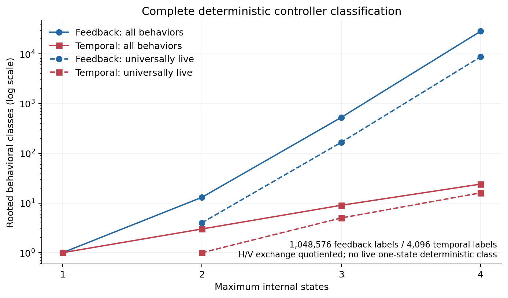
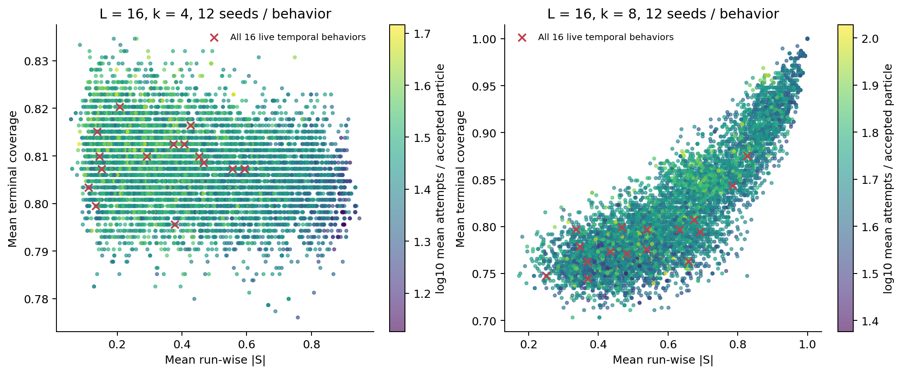
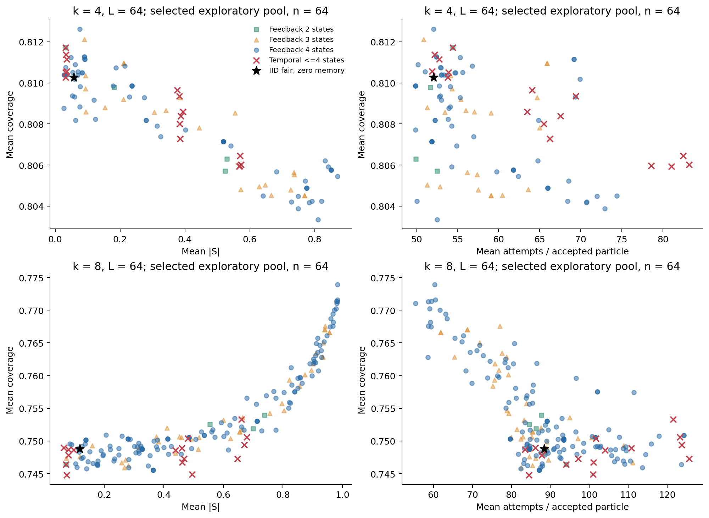
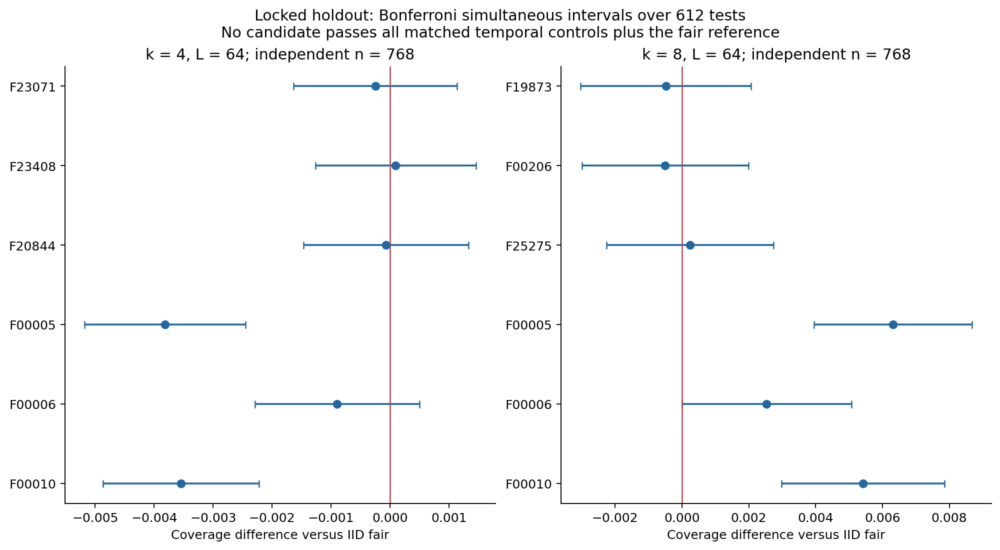
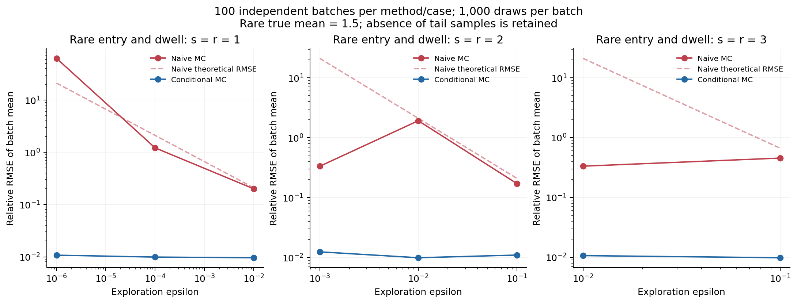

# Outcome feedback at fixed memory: finite-controller adsorption, matched temporal nulls, and singular exploration costs

**Stage III working manuscript — 4 October 2026.** AI-assisted computational research; not peer reviewed. Earlier stages are frozen historical inputs. This manuscript is delivered as Markdown; no paper PDF has been generated.

## Abstract

How much does a success/failure observation buy an irreversible deposition controller with a fixed memory budget? We enumerate all 1,048,576 labelled deterministic four-state binary Moore controllers, remove unreachable states, minimize outcome-word behavior, and quotient rooted relabelling and global orientation exchange. The result is 28,534 behavioral classes, including 8,730 with a universal failure-cycle liveness certificate. The matched outcome-blind four-state space has 4,096 labels but only 24 classes, of which 16 are live. One bit already supports outcome-sensitive behavior and exact tiny-system cost–imbalance frontier extensions; it is therefore inappropriate to presume that useful feedback first appears with two bits. A multifidelity study records 284,040 terminal RSA runs. Independent confirmation of six candidate/rod-length mechanisms plus one-bit controls yields 379 Holm rejections among 612 locked directional tests and 36 pairwise joint wins, but no candidate passes the density, imbalance and cost gate against the complete live temporal catalogue and IID fair reference. This is a bounded, selected-candidate result, not a macroscopic impossibility theorem. Separately, exact finite failure kernels reveal exploration poles through a difference of directed tree and forest valuations. Persistent and resetting progress have equal shortest-path cost but different mean exponents, disproving an unqualified path-counting rule. Two million fixed-model observations demonstrate rare-entry blindness and its remedy by conditional Monte Carlo. The strongest supported conclusions concern matched-memory methodology, model-specific operational equivalence, and repair-dependent singular kinetics.

## 1. Research question and context

An adsorption controller can change orientation without knowing where particles have landed. Its only new information may be whether the preceding proposal succeeded. This apparently weak signal is informative about the current legal-anchor population, but exploiting it also changes temporal correlations. A comparison against independent fair orientation proposals can consequently confuse feedback value with an ordinary schedule effect. Increasing controller memory makes that distinction sharper: a four-state temporal schedule is a stronger comparator than a one-state coin or a two-state alternator.

We ask whether outcome access enlarges achievable performance at a strictly matched state budget. Performance has four coordinates: terminal coverage, run-wise global orientation imbalance, trial cost per accepted particle, and liveness. Maximizing coverage alone is insufficient. A controller can gain density by strongly favoring one direction, while an initialization mixture makes its *ensemble* signed imbalance vanish. Likewise, a policy may complete almost surely yet have prohibitive waiting times. These tradeoffs must be retained rather than reduced to a favorable density statistic.

Outcome-dependent orientation choice itself is not new to RSA. [Lebovka and colleagues' relaxation RSA protocol](https://arxiv.org/abs/1109.3271) retains a rejected rod while retrying random positions and selects a new particle after successful deposition. In controller terms, this admits a two-state stochastic orientation-retention representation. Their stopping convention permits exhaustion in one direction while the other still has space, so published endpoints are not same-protocol ground truth for our universal two-action liveness objective. The present question is the value of outcome access against complete matched-memory temporal behavior, not invention of the feedback concept.

Bounded finite-state policies are established objects in partially observed control. [Poupart and Boutilier's bounded-controller work](https://proceedings.neurips.cc/paper_files/paper/2003/hash/4c5bcfec8584af0d967f1ab10179ca4b-Abstract.html) searches stochastic finite-state policy spaces for POMDPs; our objective is instead irreversible finite-lattice deposition with outcome-only observation. Canonical accessible-automaton enumeration also predates this study, including [Reis, Moreira and Almeida's representation](https://arxiv.org/abs/0906.2477), presented at DCFS 2005 and posted to arXiv in 2009. We use these classical ideas in a small fully auditable Moore-controller classification, not as a claimed new general automata theorem.

The study has three complementary resolutions. Structural enumeration is exhaustive within four deterministic states. Exact packing analysis is exhaustive for the live temporal and one-bit catalogues on a tiny geometry, with selected larger mechanisms added. Larger-lattice performance is a multifidelity search followed by independent confirmation. These levels support different statements. Exhaustive structural counts do not make the larger-lattice performance search exhaustive, and exact finite-size examples do not imply asymptotic adsorption gains. The earlier stages' negative results remain unchanged and are not re-tested to obtain a different narrative.

## 2. Model, memory and objectives

On an L×L square lattice, a proposed length-k rod is horizontal or vertical. An anchor is uniform over the boundary-admissible anchors for the proposed orientation; the rod is accepted if all its cells are empty and otherwise leaves occupancy unchanged. Main screening uses periodic boundaries, k=4 or 8, and an initially empty lattice. Exact capability comparisons use L=3,k=2 under periodic and open boundaries. No controller sees anchor coordinates, occupancy, coverage, legal-anchor counts or a simulation clock.

A deterministic rooted Moore controller has states q, binary output g(q), and transitions f(q,F), f(q,S). It emits g(q) before observing the next outcome. The initial root is fixed. Four states require two bits of evolving state, but a controller minimizing to two states belongs to the one-bit subspace. Three states is an intermediate state budget implemented in two bits; a full two-bit claim must still face every temporal controller with at most four states. We distinguish behavioral minimal memory from unused labels and from geometry-specific operational memory.

Each realization draws one independent global H/V exchange, fixed for its entire duration. This balances the initial orientation without adding evolving controller memory. Redrawing that bit at each attempt would define a different stochastic policy. The same convention applies to temporal comparators. IID fair proposals are included separately as a stochastic zero-memory reference; they are not one of the deterministic constant-output one-state policies.

For horizontal and vertical accepted counts N_H,N_V, define

\[
\theta=k(N_H+N_V)/L^2,\qquad
S=(N_H-N_V)/(N_H+N_V).
\]

The imbalance objective is E|S|, not |ES|. Let A count actual attempted proposals and N=N_H+N_V the terminal particle count. The cost objective is E[A/N], with failures per particle an equivalent offset on these nonempty runs. This expectation of a ratio is generally different from E[A]/E[N]. Exact analysis therefore tracks terminal-probability-weighted attempt rewards, not only marginal expected attempts. Simulator event aggregation samples actual failure counts; it does not replace them with conditional waiting-time means.

Geometric jam means neither action has a legal anchor. Controller deadlock means legal anchors remain but the controller's entire future failure orbit cannot visit a legal action. The simulator recognizes the latter structurally, without an arbitrary failure cutoff. Its reported deadlock cost is finite pre-recognition cost, not an invented finite waiting time through an infinite blocked tail. Primary competitors must have the stronger universal liveness certificate described below. This constraint is distinct from observing zero deadlocks in a finite sample.

## 3. Complete structural classification and liveness

Two controllers are equivalent when they emit identical action strings for every finite outcome word, including the empty word. The classifier first removes outcome-unreachable states, refines Moore equivalence to a fixed point, and numbers the quotient by rooted breadth-first traversal, failure before success. A global action exchange normalizes the root output to H. It preserves all arbitrary-word behavior up to that one exchange. Equivalence is not inferred from matching empirical means or a collection of observed trajectories.

| Available states | Feedback labels | Feedback classes | Live feedback | Temporal labels | Temporal classes | Live temporal |
| ---: | ---: | ---: | ---: | ---: | ---: | ---: |
| 1 | 2 | 1 | 0 | 2 | 1 | 0 |
| 2 | 64 | 13 | 4 | 16 | 3 | 1 |
| 3 | 5832 | 527 | 166 | 216 | 9 | 5 |
| 4 | 1048576 | 28534 | 8730 | 4096 | 24 | 16 |

The exactly-minimal feedback counts at one through four states are 1,12,514,28007; the temporal counts are 1,2,6,15. These are arbitrary-outcome-word classes, not a count of distinct RSA terminal laws from an empty lattice. All labelled multiplicities are retained. In particular, each exactly-four-state minimal class has twelve labelled representatives: six root-preserving state permutations and two global orientations. Smaller classes have unequal extension weights. Sampling duplicate labels as equally distinct policies would therefore distort the behavior-space distribution.

Counts receive independent structural checks. A second generator enumerates accessible rooted BFS restricted-growth graphs and uses pair-distinguishability rather than the main partition refinement. Its key sets agree through four states. For d transition symbols, accessible labelled graph counts satisfy

\[
A_n=n^{dn}-\sum_{r<n}{n-1\choose r-1}A_r n^{d(n-r)}.
\]

Partitioning by the root-reachable set proves the recurrence. Accessibility makes a rooted automorphism trivial, so division by (n−1)! gives canonical topology counts. For two symbols these are 1,12,216,5248. Temporal behavior also has a closed sequence count: a minimal machine produces an ultimately periodic binary word with preperiod μ and primitive period λ, μ+λ=n. Counting primitive period words and the last prefix mismatch gives the temporal minimal counts independently. Full derivations and machine-readable certificates are in [CLASSIFICATION.md](../docs/CLASSIFICATION.md).

**Liveness proposition.** A deterministic controller is universally live on every abstract frozen two-action geometry with at least one positive success probability, from every outcome-reachable controller state, exactly when each reachable failure-map cycle contains both actions. If only one action is legal, a mixed cycle attempts it repeatedly, with positive success chance per traversal; finite-state survival then decays in blocks. A monochromatic cycle instead gives a witness geometry in which its action is illegal and the other legal. Successful updates preserve reachability, allowing the argument to repeat after each placement. Finite capacity then leaves geometric jam as the only terminal possibility.

Necessity concerns this abstract universal requirement. It is not a claim that every witness geometry arises from an empty RSA lattice at every L/k. One fixed orientation fills monomers but fails the universal certificate. Under the deterministic model, one state is insufficient and two states are sufficient: failure alternation between H and V is live, regardless of the two success targets. Thus minimum universal deterministic liveness requires one bit. IID fair orientation choice is live without evolving state, so the qualifier “deterministic” is essential.

*Figure 1. Complete structural compression and the live hierarchy. Behavior counts are not packing-performance claims.*

## 4. Minimal memory and exact small-system capability

Outcome-sensitive expression already begins with one bit. Take two states outputting H,V, with failure toggling state and success retaining it. Starting at H, the shortest counterfactual pair F and S gives H,V and H,H. Every outcome-blind controller emits the same next action for equal-length outcome words and cannot match both. Empty words cannot distinguish them. A single observed trace can nevertheless be matched by a temporal schedule; it is the counterfactual pair that establishes input sensitivity, not an isolated trajectory.

The exact survey contains 86 controller/system cases for 43 identities under both boundaries. It covers all sixteen live temporal classes, all four live one-bit feedback classes and IID fair, then adds middle-stage L64 mechanisms selected by constrained budget/Pareto screening and all locked candidate identities. Every rational terminal law and weighted attempt mass is retained. Larger feedback performance is not exhaustively surveyed. Exact means require no significance tests, but their geometric scope remains L=3,k=2.

A concrete one-bit tradeoff uses success-reset V: initial output H, failure toggling H/V, and every success setting the V-output state. Its key is `2:01:1,1,0,1`, abbreviated F00010. Its first transition is outcome-independent; its shortest abstract sensitivity pair is FF versus FS, yielding H,V,H and H,V,V. An empty-start RSA first proposal must succeed, but SF versus SS gives the same output distinction and both histories have positive probability on the exact L3,k2 systems: after the initial placement, the next V proposal can overlap or fit. Thus the sensitivity is not confined to an unrealizable initial failure. Relative to temporal alternation, it has equal density but a lower cost and slightly higher imbalance:

| Boundary | Controller | Eθ | E(abs S) | E[A/N] |
| --- | --- | ---: | ---: | ---: |
| Periodic | Alternation | .8796399521 | .4055580741 | 4.3988332117 |
| Periodic | F00010 | .8796399521 | .4084149970 | 4.3723622760 |
| Open | Alternation | .8775297619 | .4928875812 | 3.7556734960 |
| Open | F00010 | .8775297619 | .4945921266 | 3.7263208174 |

The exact periodic differences are Δθ=0, ΔE|S|=334/116909 and ΔE[A/N]=−4481/169280; the open differences are 0,3/1760 and −263/8960. Neither controller dominates the other. F00010's objective point is not dominated by any of the complete sixteen deterministic temporal classes under either boundary. One bit therefore already adds a genuine tiny-system cost–imbalance tradeoff point. It does not improve all coordinates, establish a large-lattice benefit, or show that two bits first make feedback useful.

Across the selected larger-feedback subset, seven periodic and thirteen open identities add such discrete non-dominated points. Zero surveyed controllers dominate every temporal comparator. The maximum selected feedback densities, .885692 periodic and .883999 open, are below the temporal catalogue maxima .888209 and .887412. These maxima do not settle the other objective coordinates. Convex mixtures are a stronger, separately numerical comparator; discrete-frontier extension is not automatically a mixture-impossibility certificate.

**Model-specific operational-equivalence proposition.** The locked three-state mechanism F00206 has the same empty-start RSA process law as temporal alternation. Its outputs are H,H,V and transition rows [F,S] are [[1,2],[2,2],[1,1]]. Only state0 depends on outcome. Every first boundary-valid proposal on an empty lattice succeeds, so actual execution enters state2 and thereafter alternates unconditionally between states2 and1. Coupling the same anchor sequence proves identical actions, outcomes, occupancy, terminal reasons and actual trial counts for every admissible L/k and both boundaries. Arbitrary-word Moore minimization correctly keeps three states because an initial failure is a counterfactual word. Here structural complexity exceeds operational complexity. Tiny exact metrics corroborate the coupling; differing event-engine random-stream consumption explains why identical seeds need not give identical individual realizations. This theorem depends on the empty initial geometry and boundary-valid-anchor sampler; it is not a general feedback no-go theorem.

## 5. Multifidelity search, synthesis and independent confirmation

We avoid a million-controller large-lattice simulation. Complete structural pruning first leaves 8,730 live feedback classes, sixteen live temporal classes and IID fair. Coarse screening evaluates each catalogue role at L=16, k=4/8 with twelve seeds, producing 209,928 terminal runs in 17,494 groups. Temporal behavior also occurs inside the feedback catalogue; these deliberately explicit comparator roles are duplicate behavior, not independent scientific replicates. The complete structural space is retained even when performance screening stops following a class.

Selection combines empirical non-dominated sets with constrained coverage maximization over memory, imbalance and cost budgets. It scans canonical candidates rather than using reinforcement learning. All one-bit live feedback and temporal comparators are protected. The complete coarse mean frontier is recorded, but advancement has a computational cap: at most 180 feedback mechanisms per k plus sixteen temporal nulls and IID. The k4 middle stage has 106 survivors; k8 has 197 including comparators, with fifty selected mechanisms dropped by the cap and explicitly recorded. L=32/64, sixty-four fresh seeds per group, adds 38,784 runs. These noisy screening solutions are not optimizers of true expected objectives or proof that every pruned controller is inferior at larger L.

Before observations, an independent review corrected three methodological details: sealing the actual IID dependency and both catalogues; distinguishing recorded complete frontiers from capped advancement; and comparing a three-state candidate against all four-state temporal nulls for a two-bit claim. The protocol and review remain archived. Coarse, middle and confirmation seed blocks are disjoint. Exact k2 outcomes do not select or retune the confirmation hypothesis family.

*Figure 2. Mean-objective screening across the complete live behavior catalogue. Small-n points and synthesis feasibility are exploratory.*

*Figure 3. Memory and objective constraints change which empirical mechanisms survive; the plotted means are not simultaneous confidence frontiers.*

Confirmation locks three new mechanisms per k together with three genuinely outcome-sensitive one-bit controls, all sixteen temporal comparators and IID fair. At L=64 there are 768 fresh seeds per arm, 46 groups and 35,328 terminal runs. Total main research observations are consequently 284,040. The entire family has 612 directional paired Student-t tests: positive coverage difference, imbalance noninferiority with margin .01, and cost noninferiority permitting a 1.10 multiplier on the control mean. Holm correction covers all candidates, rod lengths, controls and metrics. A pairwise joint win requires all three corrected tests to pass; the full gate requires a win against every temporal null and IID. The noninferiority allowances are operational tolerances, not strict Pareto dominance.

| k | Mechanism | Minimal states | Confirmed mean θ | Mean abs(S) | Mean A/N |
| ---: | --- | ---: | ---: | ---: | ---: |
| 4 | Temporal alternation | 2 | .810338 | .033816 | 53.676 |
| 4 | IID fair | 1 stochastic | .810449 | .046723 | 52.761 |
| 4 | F23071 | 4 | .810200 | .048961 | 54.442 |
| 4 | F23408 | 4 | .810544 | .028984 | 54.109 |
| 4 | F20844 | 4 | .810384 | .059558 | 54.353 |
| 8 | Temporal alternation | 2 | .747604 | .083004 | 89.627 |
| 8 | IID fair | 1 stochastic | .748034 | .106569 | 88.229 |
| 8 | F19873 | 4 | .747554 | .093070 | 88.354 |
| 8 | F00206 | 3 structural | .747536 | .080594 | 91.147 |
| 8 | F25275 | 4 | .748276 | .126169 | 88.725 |

There are 379 corrected rejections: eighty coverage, ninety-five imbalance and 204 cost tests. Thirty-six fixed-pair joint wins all occur at k4. No candidate satisfies the complete two-bit gate; no one-bit control satisfies its smaller-budget gate. Some biased one-bit k8 controls do establish density superiority against every recorded comparator, but their imbalance is large: F00005 has mean θ=.754351 and E|S|=.741596, and F00010 has .753454 and .704319. Their density success must not be presented as a balanced packing improvement.

F23071 shows what the synthesized four-state structure adds. Outputs H,V,V,H permit distinct internal states with identical actions. Its failure transitions collapse into a mixed H/V two-cycle, while success transitions retain an additional phase. F23408 has the same output pattern and failure core but success paths produce directional pairs. Such machines separately encode successful-proposal context and failure exploration. Liveness is certified, yet the confirmed objectives do not uniformly exceed the richer temporal null. F00206's operational equivalence shows why an attractive screening mean can also represent sampling variation rather than sustained feedback.

*Figure 4. Independently sampled locked coverage contrasts versus IID fair, shown with Bonferroni simultaneous intervals for the 612-test family. The complete gate additionally uses imbalance, cost and all temporal controls. Holm decisions and Bonferroni intervals use different thresholds; ordinary pointwise intervals must not be read as simultaneous evidence.*

Student-t inference is a finite-variance large-sample approximation for seeded run differences, not a finite-sample tail guarantee. Shared seeds define pairing; different controller paths consume pseudorandom streams differently and do not create independent observations across comparisons. Holm does not require those comparisons to be independent. The negative full-gate result is limited to selected candidates, L64 and the declared objectives. It is neither equivalence proof nor absence of advantages among all pruned classes. The predeclared large-size gate failed, so this stage does not launch a new L256+ candidate search.

## 6. Exploration singularities: the right graph object

Liveness does not control the magnitude of a waiting time. On a fixed geometry, let a_o be an action's anchor-success probability, π_ε(o|q) its proposal probability and K^F_ε(q′|q,o) the conditional failure update. The correct substochastic failure kernel is

\[
F_\varepsilon(q,q')=\sum_o\pi_\varepsilon(o|q)(1-a_o)
K^F_\varepsilon(q'|q,o).
\]

The failure probability must weight the action-conditioned update; averaging transitions first generally changes the chain. For waiting time T to the next success, including its successful trial, survival is ρF_ε^n1. A reachable bottom failure class with no success leak prevents absorption. All arguments in this section concern frozen geometry, not terminal coverage of a changing RSA lattice.

For a finite rational-polynomial kernel that is nonnegative and substochastic near ε=0 and transient for small positive ε, remove identically unreachable states. Put A=I−F, D=det A and C_i equal to the determinant with column i replaced by 1. Classical first-step equations and Cramer's rule yield

\[
E_iT=C_i/D\sim C\varepsilon^{-r},\quad
r=v(D)-v(C_i),
\]

where v is the lowest nonzero power and C is the ratio of leading coefficients. Epsilon-dependent initial mixtures weight the numerator accordingly. Moment recurrence

\[
(I-F)m_j=1+F\sum_{h=1}^{j-1}{j\choose h}m_h
\]

gives exact rational higher moments. Their poles need not be multiples of the mean pole. No asymptotic exponent is obtained by fitting Monte Carlo means.

A positive graph interpretation makes the exponent auditable. Add an absorbing sink, with nonloop edge i→j weighted F_ij and leak edge i→sink weighted 1−Σ_jF_ij. A is the reduced row Laplacian. Its determinant is the positive sum of directed sink-tree products. The mean numerator is the sum of eligible two-root forests, rooted at the sink and j, with starting state i in j's component. These are classical directed forest/cofactor identities, credited to [Chebotarev and Agaev](https://arxiv.org/abs/math/0508178) and the all-minors literature. Our specialization checks the identities independently against exact determinants.

Assign each probability edge its lowest epsilon order. Let d be minimum sink-tree total order and f_i the minimum eligible forest order. Positivity prevents cancellation at the leading order, giving r_i=d−f_i. The leading constant sums all minimum-order forest coefficient products divided by all minimum-order tree products. Thus weighted topology, entry distribution and leakage coefficients matter. Unweighted shortest-path length alone does not determine the residence exponent.

For a concrete counterexample, take two blocked progress states followed by a legal state. If each exploratory advance of probability ε persists, waiting is a sum of two geometric waits and E T=2/ε+1/b, where b is legal-state success probability. If every nonexploratory failure resets progress, acceptance requires two consecutive advances and E T=ε^−2+ε^−1+1/b. Both shortest success paths cost two exploratory edges, but their mean poles are one and two. A three-step reset uses exactly four states and has pole three. Uniform legal-action exploration of probability at least cε in **every** state instead bounds the mean by 1/(caε), so cannot generate a pole greater than one at fixed availability. Exploration mechanism must therefore be specified.

Persistent scaled waiting converges to a Gamma law; reset scaled waiting converges to an exponential law. These distributional statements receive separate proofs, not inference from a mean pole. The complete assumptions, forest orientation, leading constants, nine exact examples and repair-specific bounds are in [SINGULAR_THEORY.md](../docs/SINGULAR_THEORY.md).

*Figure 5. Equal shortest exploratory path cost can produce different kinetic poles. Blocked-state advances and resets both follow failed attempts: exploratory advances progress; only nonexploratory blocked failures reset. A failed legal-state proposal stays in that legal state.*

## 7. Rare-entry blindness and a conditional estimator

A two-state phase-type family separates rare entry from long dwell:

\[
T=1+BG,\quad B\sim\operatorname{Bernoulli}(w),\quad
G\sim\operatorname{Geom}(p),\quad
w=c\varepsilon^s,\ p=\varepsilon^r.
\]

Here 0<c≤1, 0<ε<1, s and r are positive integers, B and G are independent, and geometric support is {1,2,…}. Higher powers define a nonlinear phase-type family; we do not claim every s,r arises from a two-state linear uniform-action exploration repair. Then ET=1+w/p and Var(T)=w(2−p−w)/p². Because entry probability tends to zero, T converges weakly to one. Nevertheless E T^j tends to one only when s>jr, jumps to 1+cj! at equality, and diverges when s<jr. Uniform integrability of T^j holds exactly in the first regime. A bounded mean therefore need not converge to the weak-limit mean; a diverging variance need not prevent convergence of the first moment. These are exact model statements, not finite-data conjectures.

The probability of no entry in N naive observations is (1−w)^N. Seeing one entry with 95% probability needs approximately log(20)/w samples, but observing an event is not accurate estimation of its contribution. For rare excess μ_ex=w/p, the naive mean's squared relative RMSE is (2−p−w)/(Nw), requiring order ε^−s samples for fixed relative RMS precision. A known-variance Chebyshev bound supplies a conservative confidence requirement, not an optimal-estimator lower bound. Relative precision for the *total* mean can be misleadingly easy when the rare excess vanishes.

We implement conditional Monte Carlo by integrating the known entry probability: Y=E[T|G]=1+wG. It is unbiased and has variance w²(1−p)/p², a reduction factor (2−p−w)/(w(1−p))≈2/w. Relative excess variance is at most one, so 2,000 ideal conditional observations suffice for 10% relative excess error at 95% confidence by Chebyshev. The method requires known w and a sampleable conditional dwell law; it does not solve unknown RSA rare-event estimation automatically. Variance reduction is classical, with [Glynn and Iglehart](https://web.stanford.edu/~glynn/papers/1989/GI89a.html) providing primary rare-event simulation context; the conditional identities here are derived directly.

A fixed design samples ten models, both methods, 100 independently seeded batches per method/model and 1,000 draws per batch: two million retained observations and 2,000 batch replicates. Exact moments are checked algebraically. Geometric dwell is sampled by inverse transform, not by literally executing millions of transitions. Reported empirical RMSE concerns the hundred batch means, not the pooled mean. Nominal batch t intervals are diagnostics, not a new corrected hypothesis family.

At s=r=2, ε=.001, all 100 naive batches see zero entries: every mean is one and every zero-width interval misses the exact mean 1.5. The conditional pooled mean is 1.502769. At s=r=1, ε=10^−6, 99 batches see no entry but one extreme realization lifts the naive pooled mean to 10.40901; conditional pooling gives 1.497677. Both falsely stable underestimation and violent overshoot are retained, without rerunning inconvenient seeds. For s=3,r=2, ε=.01, an all-one estimate lies within 10% of total mean 1.005 but estimates its excess as zero and misses the exact mean with every naive interval. The precision target changes the scientific interpretation.

*Figure 6. Fixed-model batch diagnostics. Algebraic variance reduction supports the method; a finite favorable count does not itself establish a universal guarantee.*

All 1,000 conditional batch means in the realized study fall within 10% of their total exact means, while nominal conditional t coverage ranges from 91 to 99 of 100. Neither number is promoted to family-wise confidence. The inherited finite 32-bit RNG and floating inverse-geometric sampler approximate the ideal laws; the smallest sampled entry probability is 5×10^−7. Exact epsilon-limit conclusions come from rational algebra, not from claiming arbitrary-precision tails in those draws.

## 8. Evidence, limitations and research boundary

The repository separates classification, individual exact laws, exploratory observations, locked confirmation, fixed-model rare measurements and proof documents. Main counts are 284,040 terminal packing runs; exact rational cases, two million rare draws and reproduced calculations are different evidence types and are not added as packing replicates. Source/plan hashes, raw identities, seed blocks and conservation relations are checked. Read-only preservation verifies all 165 Stage I, 368 Stage II and 52 website frozen files unchanged. The active four-state engine is independently checked by one-trial Markov absorption and weighted-time equations; the classifier and forest solver also use independent finite oracles.

Three limits remain substantial. First, only structural enumeration is globally exhaustive: small noisy screening and the k8 cap can discard mechanisms that improve at other sizes. Second, the deterministic temporal catalogue is complete under the declared budget, but it does not exhaust all stochastic outcome-blind controllers; external mixtures are a stronger optional diagnostic rather than a newly synthesized rooted machine. Third, fixed-geometry waiting theory does not imply continuity of arbitrary terminal RSA payoffs at a deadlocking zero-exploration implementation. Closed traps change the stopping rule, and weak waiting convergence must be proper before bounded-observable arguments apply.

The study does not establish a macroscopic feedback no-go theorem, a thermodynamic phase transition, or a minimum of two bits for useful packing. It demonstrates one-bit expressive power, the two-state deterministic liveness minimum, exact tiny-system tradeoff extensions, and failure of the selected mechanisms to meet a strong matched-memory joint gate. The most general supported addition is the explicit weighted forest certificate for repair-dependent residence poles and the rare-entry measurement comparison. Its components use classical automata, absorbing-chain, matrix-tree and conditional-expectation theory; novelty is claimed only as a reproducible outcome-limited adsorption application and worked capability distinctions, not as discovery of those general theories.

Further work should first strengthen symbolic operational equivalence and uncertainty-aware screening, then consider a small stochastic relaxation around a justified deterministic mechanism. Expanding to millions of higher-memory Monte Carlo policies would not address the current inference gap. The clean questions are which feedback structures add a new expectation frontier under a complete matched temporal budget, whether that persists with L, and when a practical rare-entry probability can be estimated rather than supplied exactly.

## Primary references and repository evidence

1. Reis, R., Moreira, N., and Almeida, M. *On the Representation of Finite Automata*. DCFS 2005; DCC-2005-04, arXiv posting 2009. [Primary record](https://arxiv.org/abs/0906.2477).
2. Poupart, P., and Boutilier, C. *Bounded Finite State Controllers*. NIPS 2003. [Proceedings abstract and paper](https://proceedings.neurips.cc/paper_files/paper/2003/hash/4c5bcfec8584af0d967f1ab10179ca4b-Abstract.html).
3. Chaiken, S. *A Combinatorial Proof of the All Minors Matrix Tree Theorem*. SIAM Journal on Algebraic and Discrete Methods 3(3), 319–329, 1982. [Publisher](https://epubs.siam.org/doi/10.1137/0603033). Bibliographic/abstract provenance; not represented as a newly read full article.
4. Chebotarev, P., and Agaev, R. *Forest matrices around the Laplacian matrix*. Linear Algebra and its Applications 356, 253–274, 2002; later author preprint. [Primary preprint](https://arxiv.org/abs/math/0508178).
5. Glynn, P. W., and Iglehart, D. L. *Importance Sampling for Stochastic Simulations*. Management Science 35, 1367–1392, 1989. [Author publication page](https://web.stanford.edu/~glynn/papers/1989/GI89a.html).
6. Lebovka, N. I., Karmazina, N. N., Tarasevich, Y. Y., and Laptev, V. V. *Random sequential adsorption of partially oriented linear k-mers on a square lattice*. Physical Review E 84, 061603, 2011. [Author preprint](https://arxiv.org/abs/1109.3271).

Detailed provenance and search limits: [LITERATURE.md](../docs/LITERATURE.md). Structural proofs: [CLASSIFICATION.md](../docs/CLASSIFICATION.md). Exact capability and operational-equivalence evidence: [MINIMAL_MEMORY.md](../docs/MINIMAL_MEMORY.md) and [exact survey](../results/exact-survey.json). Independent-engine assumptions: [SIMULATOR.md](../docs/SIMULATOR.md). Locked results: [confirmation analysis](../results/confirmation-analysis.json). Singular proofs and measurement limits: [SINGULAR_THEORY.md](../docs/SINGULAR_THEORY.md). Reproduction instructions belong to the accompanying research entry; this manuscript does not infer a clean full rerun from the existence of a script.
