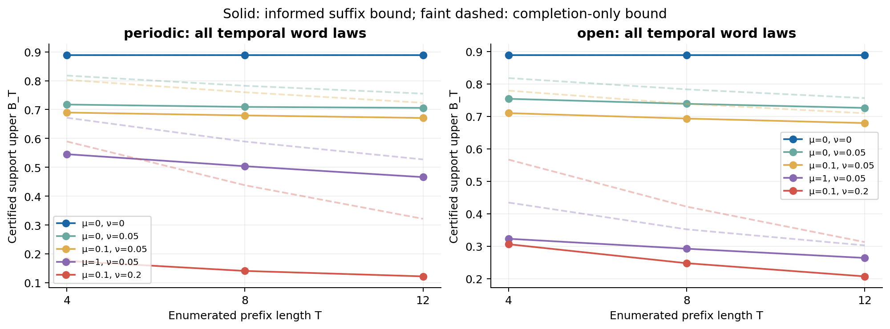
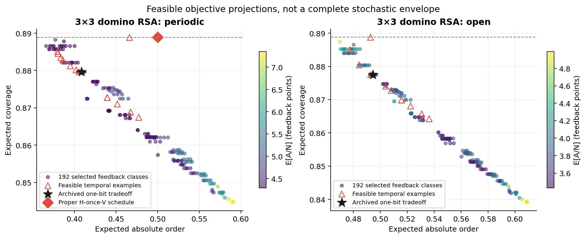
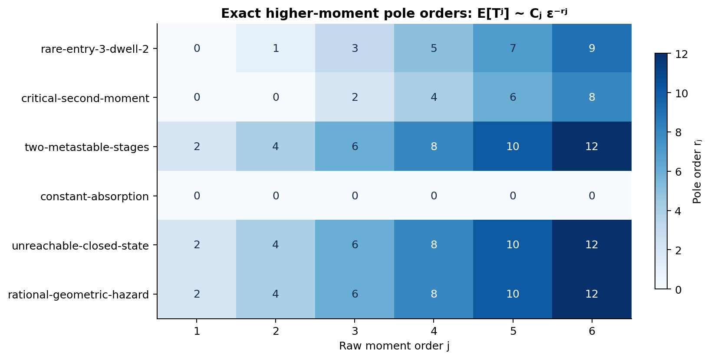
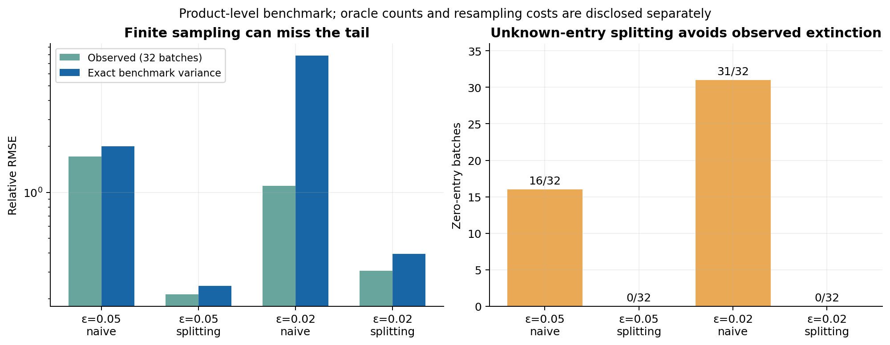

# Stochastic temporal controls and physical memory in finite lattice adsorption

**Stage IV computational research note — 4 October 2026**  
**Status:** exact results and bounded exploratory calculations; not peer reviewed.

## Abstract

Finite-state feedback in random sequential adsorption (RSA) is often compared
with deterministic temporal schedules, while controller memory is measured on
arbitrary outcome words. These conventions can overstate both feedback advantage
and physical memory. We formalize the complete outcome-independent edge-emitting
stochastic controller family with at most four states, construct rational
absorption solvers, and certify global outer supports through exhaustive temporal
prefixes with relaxed physical continuations. A forced-first-success theorem
characterizes universal operational equivalence of deterministic feedback
controllers and gives an initial-state reuse criterion. Applied to a frozen
catalogue of 28534 structural classes, it yields 22077 operational classes and
2373 state-count reductions. We prove a physical memory threshold from two to
three states, including randomized stationary realizations, and exhibit feedback
process laws that no temporal word process can reproduce. Neither result implies
a strict gap in averaged objectives. On periodic 3×3 domino RSA a two-state
proper temporal schedule attains the density bound 8/9, giving a scoped
density-only negative capability result. The complete same-memory joint frontier
remains unresolved. Separately, positive forest and layered-path germs determine
higher-moment exponents and coefficients, and fixed-effort splitting estimates
unknown-entry tail contributions with a proved ideal-oracle expectation and an
exact product-benchmark variance. All calculations preserve earlier stages;
exact certificates, failed searches and finite-precision limitations are retained.

## 1. Question, physical model and comparison rules

We ask whether success/failure feedback provides control that cannot be copied
by stochastic outcome-independent temporal scheduling under the same **physical
operational memory**. This is stronger than outperforming a finite deterministic
catalogue. It also separates two questions: equality of complete stochastic
processes, and attainable averaged terminal objectives. Different processes can
have identical averaged objectives; inability to reproduce a process is not a
Pareto advantage.

A k-rod is attempted horizontally or vertically on an L×L lattice. Given the
orientation, the anchor is uniform among valid anchors. The anchor count is
M=L² for periodic and M=L(L−k+1) for open boundaries. Periodic footprint
multiplicities remain in the sampling law. An overlap fails; otherwise the rod
is accepted irreversibly. We stop only when neither orientation can fit: a
controller that keeps failing while the other orientation fits is nonproper,
not a geometrically jammed trajectory.

The objective vector is (θ,E|S|,E[A/N],liveness), with θ denoting expected
kN/L², S=(2N_H−N)/N and A the number of attempted trials through jam. In
particular E[A/N] is not replaced by E[A]/E[N]. Complete operational equivalence
includes action, outcome and occupancy traces, stopping and terminal laws.
Stationary hidden states are the memory budget. External persistent coins and
unreported first-attempt clocks are charged when required to implement a law.

Stage I–III data, controller classification and conclusions are frozen. Stage
IV neither reenumerates old controller encodings nor reruns old packing
experiments. Its new large calculation is deterministic physical classification;
new objective calculations are restricted to exact tiny systems. No controller
above four states and no new large-lattice packing Monte Carlo are introduced.

## 2. The complete stochastic temporal family

An n-state controller, n≤4, has initial distribution π and nonnegative matrices
K_H,K_V satisfying π1=1 and (K_H+K_V)1=1. In state q it draws the pair
(a,r) with probability K_a(q,r). The selected next state is the same irrespective
of adsorption success or failure. Thus

\[
p(a_1\ldots a_t)=\pi K_{a_1}\cdots K_{a_t}\mathbf1.
\]

Action and next state may be correlated. A factorization into an emission
probability and an action-independent state transition misses valid controllers.
Including π, the interior dimensions for n=1,2,3,4 are 1,7,17,31. IID coins,
switching chains, deterministic cycles and mixtures are nested examples only.
No finite scatter of such examples establishes the complete null frontier.

Hidden representations are redundant. State permutations and unreachable states
are elementary redundancies; a positive non-permutation similarity is also
recorded. If S1=1, π'=πS and K'_a=S⁻¹K_aS preserve word probabilities whenever
they are nonnegative. Exact rational reachable-row-span equivalence decides
whether two finite realizations agree on every word, supplying a word witness
when they do not. This uses classical probabilistic-automaton linear methods
[Tzeng, 1992](https://epubs.siam.org/doi/10.1137/0221017). It is not a new general
equivalence algorithm. Nonunique HMM representations are established in the
literature [Vanluyten et al.](https://www.sciencedirect.com/science/article/pii/S0167691107001429).

Hankel rank of p(uv) lower-bounds the state count of every positive temporal
realization. The retained edge examples have ranks 2,3,4, respectively, proving
their actual temporal minima; fair IID has rank one. Rank below declared state
count need not permit a positive realization of that rank. General positive
minimization remains open, consistent with the distinction between linear and
positive realization [Huang et al.](https://arxiv.org/abs/1411.3698).

**Proposition 1 (temporal physical identifiability).** On any valid square
geometry L≥2, equality of complete temporal RSA process laws is equivalent to
equality of all planned orientation-word probabilities.

Accept the first rod of any word at an anchor through cell 0, then require
failures at anchors through cell 0 for every later action. There remain legal
anchors in another row or column, so this occupancy is never jammed. The
probability of that observable first-footprint/all-failure trace equals the
word probability multiplied by a known positive geometry factor independent
of hidden state. Equality of process laws therefore recovers all word
probabilities. Conversely, couple equal word laws to equal anchors. This
argument works at a fixed geometry, rather than requiring arbitrarily large L.
It does not compute the minimum among possible feedback realizations.

Exact tiny evaluation uses product states (mask,N_H,q). Success strictly
increases occupancy; failure is handled through rational inverses of I−F_x.
Reachable product states, not just globally reachable controller states, determine
the inverted block. We retain terminal joint masses and attempt first-moment
masses, checking their weighted sum against an independent inverse-terminal-N
reward recursion. A one-attempt residual checker, using direct raw anchors,
verifies selected Bellman certificates without copying the inversion algorithm.

## 3. Operational equivalence and real memory

**Theorem 1 (forced-success quotient).** For deterministic stationary feedback
controllers on all valid L at fixed k, universal operational equivalence is
exactly equality of the initial action and of the arbitrary-outcome-word
continuation rooted immediately after the forced first success.

Sufficiency follows by coupling anchors. To prove necessity, suppose a finite
continuation distinguishes two controllers and contains at most J successes.
With j accepted rods there are jk occupied cells, each blocking at most k
anchors per orientation. Choose M>Jk². A legal anchor remains for both actions
at every prefix, and an occupied cell provides a failed anchor for either
action. Every desired post-first-success S/F word can therefore be realized
with positive probability without prior jam. A continuation distinction is
physical on this sufficiently large geometry.

Let the minimized continuation have d states, root r, and first action a₀.
Its minimal deterministic stationary operational state count is

\[
m=d+\mathbf1\{\text{no continuation state }q
\text{ has }g(q)=a_0,\delta_S(q)=r\}.
\]

The continuation's d states are necessary by the theorem. The first state can
be reused precisely under the displayed output/update condition; otherwise
one extra state implements the prefix. We must not delete an initial F branch
that becomes observable when its state is revisited later.

Applied to all 28534 frozen structural classes this yields 22077 universal
operational classes. Their minimum-state histogram is 1/11/422/21643 for
one/two/three/four states. State counts decrease for 2373 source controllers,
including 388 archived strictly live controllers. The class merge count 6457
and state-reduction count 2373 measure different changes.
The frozen catalogue normalizes orientation exchange to first action H;
these counts do not additionally count label-swapped first-V counterparts.
The equivalence statements retain actual H/V labels, rather than equating them.

At fixed geometry, full trace automata and catalogue-minimum realizations give
48 physical classes on L=2,k=2 and 16212 on L=3,k=2, for each boundary.
Corresponding one/two/three/four-state class counts are 1/5/12/30 and
1/11/390/15810. Equal boundary counts are not equality of boundary laws.
These are deterministic minima, not an assumed solution of stochastic positive
feedback realization.

*Figure 1. Complete deterministic classification and a separately proved
randomized memory threshold. Product automaton sizes are not controller memory.*

**Theorem 2 (randomized memory activation).** The three-state controller with
outputs (H,H,V), F/S transitions ((1,1),(2,0),(1,0)), and initial state 0 has
minimum stationary feedback memory two at periodic L=2,k=2 and three at L=3.
Randomized realizations do not lower these minima.

At L=2 an explicit two-state hold-S/toggle-F realization is equivalent; positive
deterministic H and V traces exclude one state. At L=3 consider SF at anchors
0,0 and SSF at anchors 0,3,0. They have probabilities 1/81 and 1/729 and prescribe
next V and next H. Immediately before their final F both prescribe H. A
two-state randomized realization matching deterministic H and V must have one
H-only and one V-only emission state. Both pre-F histories concentrate on the
same H state, whose conditional H,F update cannot differ between histories.
Thus two states are impossible. For larger periodic L the same witness embeds
by replacing the second-row anchor 3 with L; the universal three-state
realization remains an upper bound.

Fixed-geometry product BFS finds shortest positive distinguishing histories or
certifies equivalence after exhaustion. A resource cap returns an unresolved
status. An abstract suffix witness plus the M>Jk² construction gives a sufficient
finite geometry; it does not assert minimum size. Minimum L is certified for the
activation example by closing every smaller valid L, not by guessing a size.

## 4. Global temporal bounds and a scoped negative result

For μ,ν≥0 write J=Eθ−μE|S|−νE[A/N]. A temporal policy is a distribution of
infinite orientation words independent of anchors. Its J cannot exceed the
maximum fixed-word upper reward. We enumerate every orientation prefix of
length T=4,8,12, retaining paths that jam earlier at their actual attempt counts.
After a live prefix, relax the continuation.

The basic suffix lets the current occupancy choose any reachable terminal
completion, charging at least one trial per additional acceptance. The informed
suffix allows occupancy feedback but charges future trials by 1/N_max, which
underestimates 1/N. Past T/N remains exact in terminal rewards. With legal count
l_a, the full-information value satisfies

\[
V_T(x)=\max_{a:l_a>0}
\left[\sum_y{m_{xy}\over l_a}V_T(y)-{\nu M\over N_{\max}l_a}\right],
\quad V_T(x_{\rm jam})=\theta-\mu|S|-\nu T/N.
\]

Its one-attempt Bellman inequalities bound any proper suffix. Taking the
maximum over all prefixes gives B_T, and hence

\[
E\theta\le B_T(\mu,\nu)+\mu s+\nu c
\quad\text{under }E|S|\le s,\ E[A/N]\le c.
\]

These bounds cover every ≤4-state temporal HMM and even unlimited-memory
temporal word laws. They are **outer** relaxations: the informed suffix can
observe occupancy and may not be implementable by any temporal controller.
Thus a point below the bounds is not certified attainable.

Square transposition permits first-H prefixes only for these invariant
objectives: 8,128,2048 prefixes at the three horizons. Counts stay below the
exact safe-integer limit; all reward scaling and comparisons are BigInt
rationals. The stored 60 supports include exhaustive raw numerators and
separate maximizing-prefix replays. This is not a stochastic parameter optimizer.

*Figure 2. Five fixed multiplier pairs per boundary. Curves are certified global
outer supports, not attainable four-state frontiers.*

**Theorem 3 (periodic density-only optimum).** Among fixed-geometry-proper
≤4-state temporal controllers on periodic 3×3 domino RSA, maximal expected
coverage is 8/9, attained by a two-state H-once-V-forever schedule.

Parity gives the upper bound. After one H acceptance each column admits one V
rod; the two partially occupied columns each have arrival rate 1/9 and the
remaining column rate 3/9. Completing these coupons yields exactly four rods.
Expected remaining attempts are
9+9+3−9/2−9/4−9/4+9/5=69/5. Including the first attempt gives E[A/N]=37/10,
and E|S|=1/2. Exact joint-law and independent residual certificates agree.

This is a density-only negative feedback result under **fixed-geometry
properness**. The schedule fails the stronger abstract universal-liveness
criterion and is improper on open 3×3. It is not a joint Pareto inclusion or
a theorem for all boundary conditions. These distinctions are necessary to
avoid obtaining an attractive result by silently changing admissibility.

## 5. Bounded capability search and remaining joint gap

The new exact search includes all 166 archived live ≤3-structural-state
controllers, reducing to 144 universal operational classes, plus 48 additions
selected structurally from 145 four-state feature strata. On both tiny
geometries this gives 350 new exact feedback combinations and 34 unchanged
cached invariant objective points. Twenty-four new exact temporal combinations
include genuinely two-, three- and four-state edge-HMMs. An 800-point switching
grid is exploratory, not the complete null.

A secondary declared seven-coordinate two-state parameter search makes 5176
floating objective evaluations under fixed budgets. Its retained feasible
periodic and open points are evaluated rationally and independently
Bellman-checked. Neither dominates the archived one-bit tradeoff. Local failure
does not show global failure. Together with the proper boundary schedule,
Stage IV has 377 new exact combinations; these are not Monte Carlo replicates.

Memory comparison is conservative. A selected null uses no more states than a
**proved lower bound** on every randomized feedback realization of the candidate.
For the sample this is usually two, because positive histories demand certain
H and certain V, and three for the activation example. Most exact randomized
feedback minima remain intervals between this lower bound and the known
deterministic realization. Using the upper bound as if it were the minimum would
give the temporal null an unfair budget.

Universally live selected temporal examples dominate 127/192 periodic and
86/192 open feedback points in all three objective coordinates; allowing the
fixed-proper boundary schedule changes the periodic count to 128. These are
individual feasible inclusions. No feedback point crosses the global certified
outer bounds, but the remaining points are neither proved included nor excluded
from the complete same-memory stochastic region.

*Figure 3. Exact feasible pools projected onto density/order; feedback color
shows cost. The plot does not purport to fill a continuous attainable set.*

In contrast, process-law value is settled for one-bit hold-S/toggle-F feedback.
On periodic 3×3, the positive histories SS at anchors 0,3 and SF at anchors 0,0
share action prefix HH but prescribe different next actions. Given an action
prefix, a temporal hidden posterior cannot change with the anchor/outcome
history, whose likelihood factors independently of hidden state. No temporal
word process of any memory reproduces this law. This result and the unresolved
averaged-objective frontier are both retained.

## 6. A new higher-moment graph step

Let F_ε be a finite rational, nonnegative substochastic failure kernel for all
sufficiently small positive ε, and let ρ_ε be its initial subprobability row.
Prune unreachable states and assume the reachable support can absorb. With
G=(I−F)⁻¹, positive all-minors forests give G_ij=W_ij/D: sink-rooted trees form
D, and eligible sink/j-rooted forests form W_ij. These identities are classical
[Chaiken](https://epubs.siam.org/doi/10.1137/0603033),
[Chebotarev and Agaev](https://arxiv.org/abs/math/0508178); Stage III already used
the mean valuation.

The classical discrete phase-type formula is

\[
E[(T)_\ell]=\ell!\rho G(FG)^{\ell-1}\mathbf1,
\qquad E[T^j]=\sum_{\ell=1}^j{j\brace\ell}E[(T)_\ell],
\]

as recorded in [Nielsen's DTU notes](https://www2.imm.dtu.dk/courses/02407/lectnotes/ftf.pdf).
The new algorithm composes leading **positive germs** along the layered Green/
failure paths. Products add valuations and multiply coefficients; positive sums
take the minimum valuation and add all tied coefficients. Forest division gives
each Green germ, then fixed-order path products and positive Stirling sums give
the raw moment. No cancellation is possible, so both exponent and constant are
retained, including critical ties. No determinant is evaluated by this algorithm.

Six new one-/two-/three-state kernels through order six yield 36 independently
matched leading terms. Entry ε³ with dwell hazard ε² gives pole orders
[0,1,3,5,7,9], despite a finite mean. Entry ε⁴ gives a critical second-moment
constant 3=1+2. Rational hazard ε²/(1+ε) gives r_j=2j and C_j=j!.
The method is local in ε, exponential in forest enumeration, and computes
leading terms rather than complete moment rational functions. It makes no
priority claim for classical forests or factorial moments.

*Figure 4. Independently verified leading exponents. A finite first moment can
coexist with diverging higher moments; tied constants are stored separately.*

## 7. Unknown rare-entry probability

Fixed-effort nested splitting avoids supplying entry probability. Simulate N
particles to each next-level hit/failure, multiply Z by the survivor fraction,
and resample N surviving states with replacement. Extinction contributes zero.
After the final level multiply Z by the average fresh nonnegative terminal mark.
The usual unnormalized empirical-measure induction shows unbiasedness with
exact level oracles and unbiased resampling: conditionally, the weighted
resampled mean equals the previous weighted killed-kernel mean. This is an
application of established splitting/SMC ideas, credited to
[Glasserman et al.](https://pubsonline.informs.org/doi/10.1287/opre.47.4.585) and
[Del Moral et al.](https://doi.org/10.1111/j.1467-9868.2006.00553.x).

The controlled benchmark has three independent levels q_i=ε and geometric
dwell hazard p=ε³, giving contribution ε³/p=1. The simulator knows ε; the
estimator receives sampled outcomes, not the analytic entry probability.
Its exact relative variance is

\[
\prod_i\left(1+{1-q_i\over Nq_i}\right)
\left(1+{1-p\over N}\right)-1.
\]

Naive n-trial relative variance is (2−p−w)/(nw), w=ε³. At fixed level count,
splitting particles for fixed relative accuracy scale as ε⁻¹ rather than naive
ε⁻³ in this model. No universal RSA complexity result follows.

At ε=.05,.02, 32 batches per method/model retain 128 batches and 64019
conditional dwells. At ε=.02, naive misses entry in 31/32 batches and has
empirical relative RMSE 1.10 versus theoretical 7.91: finite sampling itself
misses the error tail. Splitting has zero missed-entry batches, empirical RMSE
.307 and theoretical .394. Total simulator calls are 521233, plus 192000
resampling draws; equality of wall-time budgets is not asserted.

*Figure 5. Observed versus exact benchmark errors and zero-entry batches. No
confidence interval or significance claim is inferred from 32 batches.*

Real RSA useful-level design remains unimplemented. The ideal unbiasedness
theorem does not remove finite-grid PRNG and double inverse-geometric sampling
limitations in the executed benchmark. Adaptive levels and extreme-hazard
numerical bias would require further analysis.

## 8. Verification, limitations and stopping point

Current combined tests pass 24/24. Independent checks include complete
catalogue minimum comparisons, physical witnesses, raw anchor-tree prefix
evaluation, exact Bellman residuals (3384 scalar equations for the three selected
certificates), and higher-moment algebraic comparisons. A new clean source tree
reconstructs 22077 universal classes, ten T=4 supports, two joint laws and twelve
moment leading terms from sixteen hashed source/input files. This quick check
retains the old structural catalogue as scientific input; it is not a full
rerun or a website clean-clone deployment test. The final manifest seals final
sources and outputs; it does not pretend to be a pre-calculation source hash for
every earlier run. An initial negative-zero metadata test failure remains on
record and was corrected before acceptance.

The strongest completed conclusions are physical equivalence/memory, the
randomized geometry threshold, a fixed-proper density-only negative result,
and scoped higher-moment and unknown-entry methods. The complete joint stochastic
same-memory capability question remains open. Further work should target a
certified low-dimensional positive frontier or randomized physical realization,
not indiscriminate extra memory or Monte Carlo. Earlier negative results remain
unchanged. Full proof details, primary-source attribution, raw certificates and
item-by-item coverage are linked from [the Stage IV README](../README.md).
