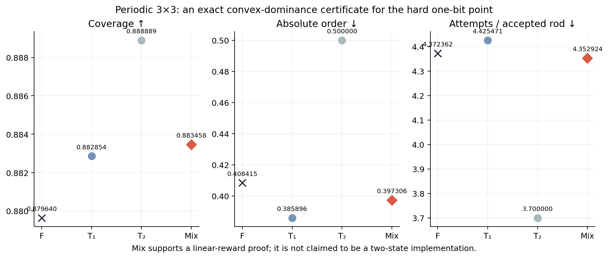
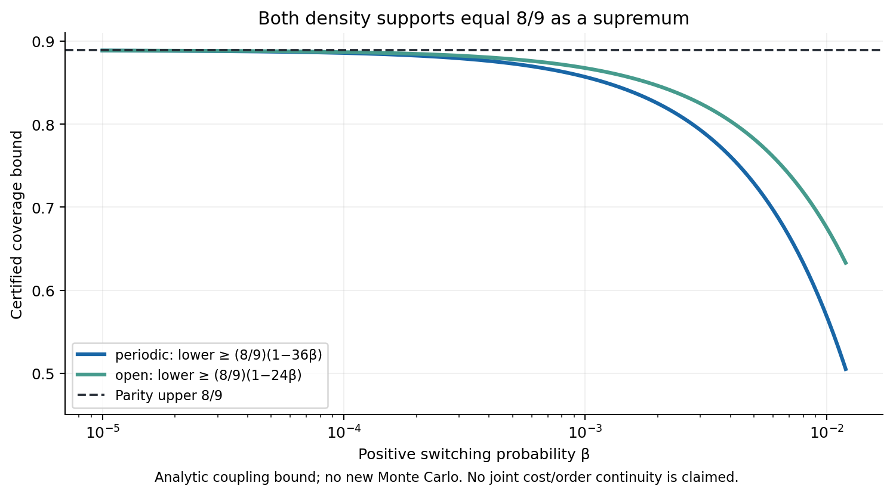
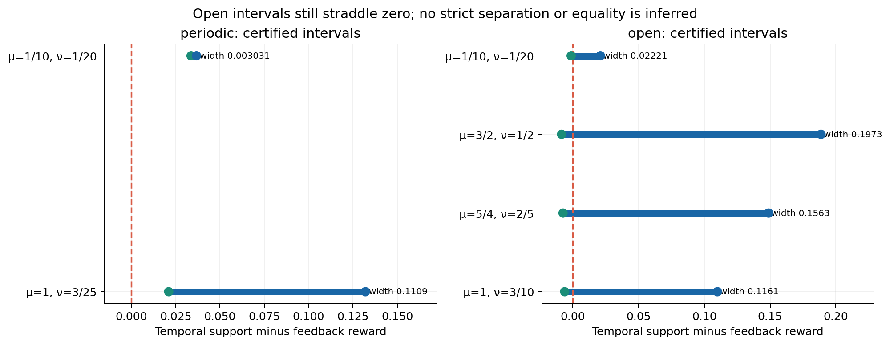

# Outcome-only control of lattice adsorption: operational memory and certified temporal comparisons

**Unified research manuscript — 4 October 2026.**
**PROJECT STATUS: PAUSED AFTER STAGE V**

This is an AI-assisted research draft, not a peer-reviewed publication.
The frozen experiments and their original conclusions remain unchanged.

## Abstract

We study irreversible adsorption of horizontal and vertical lattice rods
when a finite-state controller observes only whether its last proposal
succeeded. The relevant comparison is with outcome-blind temporal processes
at the same *physical operational* memory, rather than with independent
orientation draws alone. Deterministic feedback admits a finite behavioral
classification, but geometric impossibility, controller-induced deadlock,
and memory observable through the adsorption process are distinct notions.
We combine archived finite-size experiments with exact finite-system laws
and new global certificates for the complete two-state edge-emitting
stochastic temporal family. On the periodic 3×3 dimer lattice, every proper
deterministic one-bit feedback vector is weakly dominated by the convex hull
of proper two-state temporal vectors. Consequently no such feedback
controller improves any nonnegative linear scalarization of coverage,
absolute orientational order and trials per particle. The argument does not
require implementing a mixture within two states. On both open and periodic
3×3 lattices the two-state temporal density supremum is exactly 8/9, including
a universally live approximating family. Open-boundary joint trade-offs
remain unresolved: rigorous lower and upper supports leave signed capability
intervals crossing zero. Process-law separation from all temporal laws is
therefore compatible with absence of an averaged-objective advantage in a
scoped geometry. We distinguish structural theorems, exact tiny-system
results, archived empirical comparisons and a separate rare-event supplement.

## 1. The information constraint

Random sequential adsorption (RSA) accepts proposals irreversibly if their
occupied sites are vacant. On an L×L square a proposal chooses an orientation
`a∈{H,V}` and a uniform anchor from the appropriate boundary-dependent anchor
set. Rod length is k. A controller receives only `S` or `F`, the success or
failure of that proposal. It cannot inspect the occupancy, count available
placements, reject an inconvenient successful proposal, or reset the
physical configuration. Anchor draws are independent of the controller.

A deterministic Moore feedback machine emits a direction from its state
and updates its state after observing S/F. A randomized machine may randomize
its action and state updates, but all persistent information must be counted
as controller state. This convention excludes a free remembered random
selector. The outcome-only premise is restrictive: a failure mixes information
about local obstruction, direction-dependent availability and sampling noise.
It is also not a novel feedback concept. Relaxation RSA has already used
success/failure-dependent orientation dynamics; see Lebovka et al. (2011).
Our question concerns matched memory and certified control comparisons,
not priority for outcome-dependent adsorption.

Let N be the accepted-particle count at geometric jam, `A` the number of
proposals through that stopping time, `θ=kN/L²`, and
`S=(N_H-N_V)/N`. The three objectives are `Eθ`, `E|S|` and `E[A/N]`.
They measure coverage, per-realization orientational imbalance, and sampling
cost. `E|S|` cannot be replaced by `|ES|`; similarly `E[A/N]` is not `EA/EN`.
We maximize

`J_{μ,ν}=Eθ-μE|S|-νE[A/N]`, for `μ,ν≥0`.

The declared main admissibility condition is **fixed-geometry properness**:
geometric jam is reached almost surely and the attempt cost is finite.
Abstract universal liveness is stronger: both orientations remain available
in the controller's possible recurrent behavior under the relevant outcome
conditions. It does not follow merely from physical properness on one
particular lattice. Results using one condition are not transferred silently
to the other.

## 2. Behavioral classification and the meaning of stopping

There are 64 raw deterministic one-bit source machines under the original
encoding. Behavioral minimization and direction-label symmetry reduce them
to 26 direction-labelled and thirteen H/V-normalized classes. This removes
duplicate descriptions rather than selecting favorable controllers. The
larger frozen deterministic catalogue contains 527 normalized classes at
at most three states and 28,534 at at most four; the corresponding strictly
live counts are 166 and 8,730. Temporal deterministic machines form much
smaller catalogues because their transitions cannot respond to outcomes.
These are structural classifications, not claims about a physical objective
frontier. Classical automata equivalence underlies the minimization.

A geometric jam has no legal placement in either orientation. A controller
deadlock can continue issuing a blocked orientation while the other remains
available. A long run of failures therefore proves neither jam nor a
legitimate terminal state. The distinction mattered in the archived studies:
some visually balanced one-bit strategies became trapped with substantial
empty space. Observer interventions were recorded separately to demonstrate
available placements, not credited as admissible improvements by an
outcome-only controller.

For finite exact systems we form a reachable product chain of occupancy,
orientation counts and controller state. Every reachable nonjammed state
must have a path to geometric jam. A finite chain satisfies this criterion
if and only if it has no reachable closed nonjammed class; absorption then
has a geometric tail. Improper policies are excluded rather than assigned
fabricated jam rewards or rescued by an unrecorded fallback.

On the periodic 3×3 dimer square, the proper normalized one-bit physical
classes are 4/12, 5, 6, 9 and 10. Classes 4 and 12 coincide physically because
the first proposal must succeed. On the open square only 5, 6, 9 and 10 are
proper. The classification checks all thirteen candidates, including the
failures, and records first-V counterparts by transposition.

## 3. What the finite-size evidence says

The empirical studies are archived evidence, not newly rerun simulations.
Their frozen protocols, seeds, multiplicity corrections and negative results
are retained. They establish behavior at sampled sizes and chosen comparisons;
they do not establish a thermodynamic theorem or optimize over every
stochastic temporal controller.

The original deterministic atlas and confirmations retained 226,816 main
terminal records across several experiment types. Of 36 locked Holm tests,
18 rejected their nulls: twelve negative-coverage findings, five positive
coverage findings and one isotropy finding. No candidate simultaneously
met the stated confirmed coverage-gain and absolute-order criterion in the
same rod-length comparison. Some k=8 density gains came with strong
directional bias. Near-balanced policies that switched after success and
held after failure suffered approximately 91.8–94.9% controller deadlock
in the recorded settings. These are specific measured outcomes, not an
impossibility theorem about feedback.

Randomized one-bit feedback extends the transition rules using
success-dependent and failure-dependent flip probabilities. Its archived
study retained 143,232 main terminal runs. Among 400 locked Holm comparisons,
182 rejected: nineteen positive coverage, five negative coverage and 158
order noninferiority findings. Only five met the joint fixed-comparator
criterion. Four used a deadlocking unidirectional baseline; the remaining
k=4,L=64 result compared `(α,β)=(1,.001)` with a frozen proposal-match IID
orientation probability. Its coverage difference was 0.00112629 with
pointwise 95% interval `[.00053451,.00171807]` and Holm-adjusted p=.0436331.
A separately reported 400-comparison Bonferroni simultaneous interval was
`[−.00003505,.00228763]`. Those two uncertainty statements answer different
questions and cannot be substituted for one another.

The local joint result did not persist as the same claim at larger sizes.
For example, a k=8 density gain of .00231171 against fair orientation failed
the order criterion. At the largest archived exploration size, the selected
k=8 coverage difference .00009760 had interval
`[−.00004271,.00023792]`. Failure to reject is not equivalence. A subsequent
finite-state empirical study retained 284,040 main runs and found 36 joint
fixed-pair results among 612 locked comparisons, using explicit .01 order
and 10% cost tolerances. Tolerance findings are not strict Pareto dominance
over a complete temporal family. Fifty k=8 candidates remained budget-stopped.

These observations motivate the exact matched-null problem while preserving
its uncertainty. Counts of validation runs, rescue interventions, waiting-time
diagnostics and rare-event batches are documented separately; they are not
pooled into an artificial larger inferential sample.

## 4. Physical operational memory

A controller's source-state count can overstate the memory visible in the
physical process. The first proposed rod succeeds on an empty valid lattice,
so an initial failure transition can be observationally irrelevant until
the corresponding state is revisited. Exact positive-history equivalence
must account for this forced first success rather than minimize every
abstract outcome word indiscriminately.

The frozen at-most-four-state catalogue reduces from 28,534 normalized
structural classes to 22,077 universal deterministic physical-process
classes, with minimum-state counts 1, 11, 422 and 21,643. There are 2,373
state reductions, including 388 in the strictly live subset. On the specified
tiny geometries the deterministic physical quotients contain 48 classes at
L=2,k=2 and 16,212 at L=3,k=2 for each boundary. These are deterministic
operational numbers; they are not automatically randomized minima.

Randomization can represent a law differently, so a memory lower bound must
exclude positive stochastic realizations as well. Every proper deterministic
one-bit contestant here has positive physical histories forcing H and other
histories forcing V. A one-state stationary randomized machine cannot
produce both conditional certainties. Its known two-state deterministic
realization gives an exact randomized minimum of two.

Geometry can activate additional memory. An archived three-state threshold
controller has randomized physical minimum two on the periodic 2×2 square
but three on the periodic 3×3 square. Positive-probability histories that
share a preceding certain H require different subsequent directions and
cannot be represented by the two H/V-emitting states. The recorded histories
include SF at anchors 0,0 and SSF at anchors 0,3,0, with probabilities 1/81
and 1/729. This is a process-specific lower bound, not an inference from
product-chain size or a general rule that linear Hankel rank equals positive
HMM state count.

Observing outcomes can separate complete processes even when averaged
objectives fail to improve. For hold-after-success/toggle-after-failure,
two positive histories have the same planned HH actions but different S/F
outcomes and demand different next actions. In an outcome-independent
temporal word law, conditioning on a physical history with fixed actions
multiplies the word probability by an anchor likelihood independent of
its future symbols. Such histories cannot alter the future action law in
different ways. This excludes every outcome-blind temporal word process,
even with unlimited memory, from reproducing that complete feedback process.
It does not prove a gap in its three averages.

## 5. The complete matched stochastic temporal null

A temporal controller is represented by nonnegative edge-emitting matrices
`K_H,K_V` with `(K_H+K_V)1=1` and initial row distribution π:

`P(a_1…a_t)=π K_{a_1}…K_{a_t}1`.

Action and next state are jointly sampled, independently of adsorption
outcomes. At two states, the two four-entry row simplexes give six matrix
degrees of freedom plus one initial-distribution degree. This includes IID
orientation, persistence, stochastic switching, deterministic alternation
and correlated action/state transitions. A restricted switching grid is
not the whole null. Initial-state mixtures are included; an arbitrary
mixture with a permanently remembered component is included only if it has
a two-state realization. Classical probabilistic automata and HMM theory
provide the representation and equivalence background.

For fixed kernels, reward is affine in π. A proper mixture assigns positive
mass only to proper conditional initial states, so support maximization may
take the maximum over the two initial-state vertices. This reduction does
not restrict the action/state correlation. Degenerate kernel boundaries
remain in the certified domain.

There is also a larger comparator. Sample an entire orientation word before
sampling independent anchors. For a proper finite-cost word law, almost
every conditional word is proper by Fubini, and has finite conditional
cost by Tonelli. Linearity gives `J(law)=∫J(w)dP(w)`. Therefore unrestricted
stochastic temporal support equals support over proper finite-cost
deterministic infinite words. This does not identify it with two-state
support: the sampled words can require unlimited temporal memory.

Eventually periodic words suffice for approximation of this unrestricted
supremum. Retain a proper finite-mean word's first T symbols and then alternate
H/V. From any surviving occupancy, the alternating completion has expected
remaining time at most `2MN_max`. Coupling through the prefix shows bounded
terminal-observable errors vanish with `P(A>T)`, while the cost error is
bounded by `E[A 1_{A>T}]+2MN_max P(A>T)`. Integrability closes the limit.
This proves equality of suprema, not an attained optimal finite period or
a bounded-state realization. Full statements and proofs are in
[the theorem supplement](../docs/FINAL_CAPABILITY_THEOREMS.md).

## 6. Exact capability results

### 6.1 A scoped periodic negative theorem

For periodic L=3,k=2 and fixed properness, every proper deterministic one-bit
feedback vector is weakly dominated by an explicit temporal convex-hull
vector. Classes 5 and 6 are dominated by strict alternation; class 9 has
the same objective vector as alternation; classes 4/12 reproduce H once
followed by V forever. For class 10 use the convex combination with weights
9/10 and 1/10 of switching `(H→V=1,V→H=.7)` and H-once-V-forever.

The latter combination improves coverage, decreases absolute order and
decreases cost by the exact positive amounts
`5190136/1359533565`, `96801926273279/8713915732116855` and
`5848032782749165024711/300855089910120186767040`. For any `μ,ν≥0`, its
average scalar reward is at most the better constituent's reward. Both
constituents are proper two-state temporal controllers. Hence

`max_F J(F) ≤ sup_{T: proper, ≤2 states} J(T)`

for **all** nonnegative directions, rather than just the tested supports.
No free mixture-selector memory is assumed.

The statement describes the monotone dominated closure of a temporal convex
hull. It does not show exact raw-point inclusion, equality of nonconvex
attainable sets, or a simultaneous single-controller dominator for class 10.
An attempted raw convex-membership calculation is retained as unresolved.
Moreover H-once-V-forever is periodic-fixed-proper but not abstract-universally
live, and is improper on the open square. This proof cannot be reused under
either changed condition. The theorem covers deterministic one-bit feedback,
not every randomized one-bit policy.

### 6.2 Density support closes on both boundaries

Parity gives `θ≤8/9`. Consider the two-state temporal matrices
`K_H=[[0,1],[0,0]]`, `K_V=[[0,0],[β,1−β]]`, initially in state zero.
Every positive β gives a proper universally live controller with finite
cost. As β decreases, it completes legal V placements before isolated H
probes with increasing probability. Exhaustive raw-anchor traversal of this
macro process finds only four-particle terminals on both tiny boundaries.
Coupling gives `Eθ_β≥(8/9)(1−4Mβ)`, where M is nine periodic or six open.
Thus the density supremum is exactly 8/9 in both geometries, even with the
stronger live restriction.

The periodic fixed-proper class attains this bound with H-once-V-forever,
order 1/2 and cost 37/10. Finite attainment is not asserted on the open
square. In particular, substituting β=0 there creates an improper process.
The bounded-density limit supplies no continuity theorem for the cost:
rare long excursions can preserve or increase its expectation.

### 6.3 Global support intervals and unresolved open capability

Eight scalarizations were fixed using archived objective points before new
controller optimization. The new lower search made 13,207 floating evaluations;
six retained realizations were then solved exactly and independently checked.
Floating optimizer scores are never used as global evidence.

An adaptive prefix branch-and-bound supplies upper bounds over **all**
outcome-independent words. Exact anchor-count propagation handles already
absorbed trajectories at their true stopping times. Rational full-information
suffix supersolutions account for past trial cost and a conservative future
cost. Two-child prefix subdivision maintains a complete covering of infinite
words. Six directions used 120,000 expansions altogether, recording 240,006
nodes. Independent raw-anchor propagation and rational tail inequalities
verified every recorded node bound.

A second method partitions the complete continuous two-state probability
simplexes, not a finite parameter grid. A horizon-36 bounded-simplex Bellman
relaxation permits row choices depending on physical state and time within
each box and hence upper-bounds stationary temporal kernels. It includes
singular boundaries without matrix inversion. The method evaluated 17,994
boxes and replayed all 9,000 leaf bounds. It was weaker than the unrestricted
word bound in every chosen direction and did not narrow the final intervals.
This failure limits our claimed computational closure.

Both upper-bound engines use directed BigInt fixed-point arithmetic at
scale `2^48`, with rational suffix certificates. The signed pruning cutoff
is retained in the reported upper to protect against a one-unit truncation
issue. The parameter replay shares a Bellman engine with generation; independent
geometry, LP-dual tests and direct short-horizon expansion provide additional
checks but are not a wholly independent global implementation.

| Boundary | (μ,ν) | Certified lower | Certified upper |
| --- | --- | ---: | ---: |
| periodic | (0,0) | .888888888889 | .888888888889 |
| periodic | (1,.12) | −.032359294751 | .078560569313 |
| periodic | (.1,.05) | .653888888889 | .656920069686 |
| open | (0,0) | .888888888889 | .888888888889 |
| open | (1,.3) | −.741170873053 | −.625027191999 |
| open | (1.25,.4) | −1.238716228873 | −1.082382140935 |
| open | (1.5,.5) | −1.736094210914 | −1.538781909448 |
| open | (.1,.05) | .640457328990 | .662664709658 |

Exact fractions, complete feedback comparisons and certificate mechanics
are in [GLOBAL_CERTIFICATION.md](../docs/GLOBAL_CERTIFICATION.md) and
[certificate-verification.json](../results/certificate-verification.json).
For open `(μ,ν)=(1.25,.4)`, class 10 has reward −1.231238723330241 and

`−.148856582394992 ≤ J(F10)−J* ≤ .007477505542617`.

The interval straddles zero and is too wide to decide advantage. Other
selected open directions remain undecided as well. A feedback point below
an outer support is not proven attainable by the null. The periodic negative
theorem follows from separate explicit dominance witnesses, not from failure
to cross these outer bounds.

## 7. Interpretation and reproducibility limits

At one bit of genuine physical memory, observing outcomes enlarges the
set of reproducible *process laws* in this model. For the periodic tiny
geometry it does not improve any of the specified nonnegative linear
objectives among proper **deterministic** one-bit policies. The complete
randomized-feedback comparison and open-boundary joint capability remain
open. These statements coexist without contradiction: many different
processes share or exceed the same three averaged objectives.

The exact tiny-system theorem has no thermodynamic implication. Archived
finite-size gains and failures establish neither the presence nor the
absence of a large-volume matched-family gap. The outcome-feedback mechanism,
probabilistic automata representation, finite-chain absorption criterion,
matrix-forest tools and splitting algorithms are classical or have close
prior art. Contributions here are the model-specific audited catalogues,
memory witnesses, exact dominance certificate, density-limit closure and
explicit globally bounded residual uncertainty. The literature check is
focused rather than an exhaustive novelty survey.

All sixteen existing and new research test files passed in one invocation:
142 tests, zero failures or skips. Independent raw-anchor residual checks
validated 6,800 new lower-bound Bellman equations. A clean-source reconstruction
copied fourteen source/fixture files into a separate local directory, installed
no packages, recomputed all six new exact laws, repeated both density macro
traversals, and constructed fresh small word and parameter certificates.
Its scope is a clean-directory reconstruction using current sources, not
an independently authored solver, replay of all historical Monte Carlo,
cross-platform validation, or a website clone/deployment audit.

Earlier scientific files and the website freeze retain their original
hashes. The final evidence index records archived raw and processed artifacts
without pretending they were freshly recomputed. Details are in
[REPRODUCTION.md](../docs/REPRODUCTION.md), the hostile
[FINAL_REVIEW.md](../FINAL_REVIEW.md), and
[FINAL_EVIDENCE_MANIFEST.json](../results/FINAL_EVIDENCE_MANIFEST.json).
Rare-event kinetics and estimators are separated into
[RARE_EVENT_SUPPLEMENT.md](RARE_EVENT_SUPPLEMENT.md).

## Research disclosure

Codex assisted with formalization, derivations, source implementation,
experiment execution, exact calculations, visualization, manuscript drafting
and adversarial self-review. The user supplied the research direction and
stage constraints. No human peer review, independent coauthor verification,
institutional affiliation or external acceptance is implied. The independent
checks described above are computational checks, not independent human
replication. Reasonable objections and unresolved gaps remain in the final
review. No external source code was copied into the new certification tools;
classical method attribution remains necessary.

## References

1. Lebovka et al. (2011), *Random sequential adsorption of partially oriented
   linear k-mers on a square lattice*, Physical Review E 84, 061603.
   [Publisher](https://journals.aps.org/pre/abstract/10.1103/PhysRevE.84.061603).
2. Evans (1993), *Random and cooperative sequential adsorption*, Reviews of
   Modern Physics 65, 1281. [Publisher](https://journals.aps.org/rmp/abstract/10.1103/RevModPhys.65.1281).
3. Tzeng (1992), *A polynomial-time algorithm for the equivalence of
   probabilistic automata*, SIAM Journal on Computing 21.
   [Publisher](https://epubs.siam.org/doi/10.1137/0221017).
4. Vanluyten, Willems and De Moor (2008), *Equivalence of state representations
   for hidden Markov models*, Systems & Control Letters.
   [Publisher](https://www.sciencedirect.com/science/article/pii/S0167691107001429).
5. Huang, Ge, Kakade and Dahleh, *Minimal realization problems for hidden
   Markov models*. [Author preprint](https://arxiv.org/abs/1411.3698).
6. Gallager, *Discrete Stochastic Processes*, finite-state Markov-chain
   lecture chapter (MIT, 2011).
   [Course text](https://ocw.mit.edu/courses/6-262-discrete-stochastic-processes-spring-2011/3558b08622765d26c2b0a7d2eeeac885_MIT6_262S11_chap03.pdf).
7. Holm (1979), *A simple sequentially rejective multiple test procedure*.
   [Article copy](https://www.ime.usp.br/~abe/lista/pdf4R8xPVzCnX.pdf).

Access limitations, the RRSA publisher note, additional RSA references and
methodological references are recorded in
[FINAL_LITERATURE.md](../docs/FINAL_LITERATURE.md).
